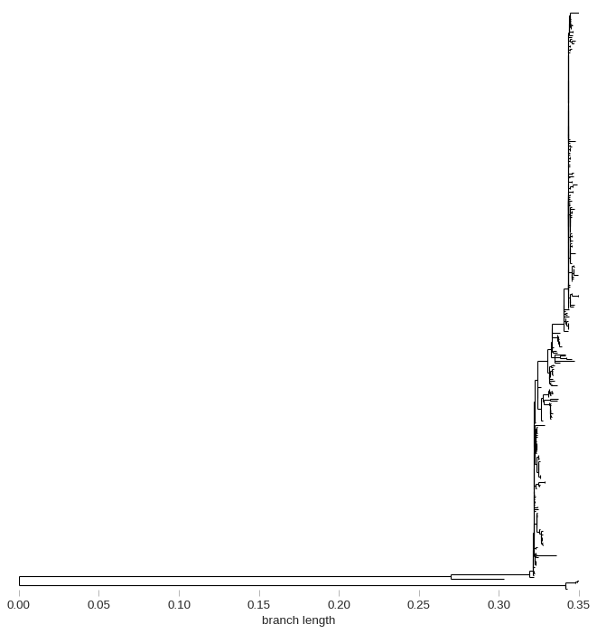

# Download, parse, extract Ontario human IAV from NCBI Influenza DB

- Download all nucleotide sequences in the NCBI Influenza DB 
- Parse Human HA gene sequences from Ontario beloning to H1 or H3
- Group sequences by subtype and flu season
- Perform multiple sequence alignments (MSA)


```python
import re
from pathlib import Path

import pandas as pd
import numpy as np

from Bio import SeqIO
from Bio import Entrez
```

Email is required to use NCBI Entrez API


```python
Entrez.email = 'peter.kruczkiewicz@canada.ca'
```

Downloaded all Influenza nucleotide sequences from the NCBI FTP site for the NCBI Influenza DB (2019-09-26T08:51:00+5):

```bash
wget ftp://ftp.ncbi.nih.gov/genomes/INFLUENZA/influenza.fna.gz
```

Output FASTA headers for H1 or H3 HA genes (`(segment 4|\(HA\)|hemagglutinin)`) Influenza A from Ontario (`(Ontario|Toronto|Canada-ON)`) to `ontario-H1-H3-HA-gene-seg4-or-HA.txt`

```bash
zcat influenza.fna.gz | grep -P "^>.*A.*/(Ontario|Toronto|Canada-ON)/.*\(H(1|3)N\w\).*(segment 4|\(HA\)|hemagglutinin)" > ontario-H1-H3-HA-gene-seg4-or-HA.txt
```

Extract GI/NCBI ID from FASTA headers with regex


```python
header = '>gi|52078172|gb|AY619969|Influenza A virus (A/swine/Ontario/K01477/01(H3N3)) hemagglutinin (HA) gene, complete cds'
```

Check that the number after `>gi|` can be parsed


```python
REGEX_GI = re.compile(r'>gi\|(\d+)')
m = REGEX_GI.match(header)
if m:
    print(m.group(1))
```

    52078172


Parse all GIs


```python
gis = []
with open('ontario-H1-H3-HA-gene-seg4-or-HA.txt') as f:
    for l in f:
        m = REGEX_GI.match(l)
        if m:
            gis.append(m.group(1))
```

Should have 892 unique GIs


```python
assert len(set(gis)) == len(gis)
len(gis)
```


    892


Fetch Genbank entries for each of the 892 GI/NCBI IDs 


```python
with Entrez.efetch(db='nucleotide',
                   id=gis,
                   rettype='gb',
                   retmode='text') as efetch_handle:
    entrez_gb_recs = [x for x in SeqIO.parse(efetch_handle, 'genbank')]
```

Should have retrieved 892 Genbank records


```python
len(entrez_gb_recs)
```


    892


Peek into one of the Genbank entries


```python
gb_rec = entrez_gb_recs[0]
```


```python
gb_rec
```


    SeqRecord(seq=Seq('ATGAAGACCATTATTGTTCTGAGTTGTTTTTTCTGTCTGGCTTTCAGCCAAAAT...TGA', IUPACAmbiguousDNA()), id='AY619969.1', name='AY619969', description='Influenza A virus (A/swine/Ontario/K01477/01(H3N3)) hemagglutinin (HA) gene, complete cds', dbxrefs=[])


```python
gb_rec.name
```


    'AY619969'


```python
gb_rec.description
```


    'Influenza A virus (A/swine/Ontario/K01477/01(H3N3)) hemagglutinin (HA) gene, complete cds'


```python
gb_rec.annotations
```


    {'molecule_type': 'RNA',
     'topology': 'linear',
     'data_file_division': 'VRL',
     'date': '28-DEC-2004',
     'accessions': ['AY619969'],
     'sequence_version': 1,
     'keywords': [''],
     'source': 'Influenza A virus (A/swine/Ontario/K01477/01(H3N3))',
     'organism': 'Influenza A virus (A/swine/Ontario/K01477/01(H3N3))',
     'taxonomy': ['Viruses',
      'ssRNA viruses',
      'ssRNA negative-strand viruses',
      'Orthomyxoviridae',
      'Influenzavirus A'],
     'references': [Reference(title='Characterization of avian H3N3 and H1N1 influenza A viruses isolated from pigs in Canada', ...),
      Reference(title='Direct Submission', ...)]}


```python
gb_rec.features
```


    [SeqFeature(FeatureLocation(ExactPosition(0), ExactPosition(1701), strand=1), type='source'),
     SeqFeature(FeatureLocation(ExactPosition(0), ExactPosition(1701), strand=1), type='gene'),
     SeqFeature(FeatureLocation(ExactPosition(0), ExactPosition(1701), strand=1), type='CDS')]


```python
gb_rec.features[0].qualifiers
```


    OrderedDict([('organism',
                  ['Influenza A virus (A/swine/Ontario/K01477/01(H3N3))']),
                 ('mol_type', ['genomic RNA']),
                 ('strain', ['A/swine/Ontario/K01477/01']),
                 ('serotype', ['H3N3']),
                 ('db_xref', ['taxon:292589'])])


Check that all Genbank records have a source feature as the first sequence feature


```python
all([x.features[0].type == 'source' for x in entrez_gb_recs])
```


    True


Parse metadata from Genbank source sequence feature qualifiers


```python
def parse_gb_md(rec):
    source_feature = rec.features[0]
    assert source_feature.type == 'source', rec
    return {k:v[0] for k,v in rec.features[0].qualifiers.items()}
```


```python
def genbank_md(rec): 
    out = parse_gb_md(rec)
    out['accession'] = rec.id
    return out
```

Convert list of metadata dicts to Pandas DataFrame


```python
df_gb_md_892 = pd.DataFrame([genbank_md(x) for x in entrez_gb_recs])
```

Parse/coerce `collection_date` values into standard DateTime format (`pd.Timestamp`)


```python
dates = pd.to_datetime(df_gb_md_892.collection_date, errors='coerce')
years = [x.year if not pd.isnull(x) else None for x in dates]
df_gb_md_892['collection_year'] = years
df_gb_md_892.collection_date = [str(x).split()[0] if not pd.isnull(x) else None for x in dates]
```

Set values for collection year, month and day in DataFrame


```python
df_gb_md_892['collection_month'] = dates.dt.month
df_gb_md_892['collection_day'] = dates.dt.day
```


```python
dts = pd.to_datetime(df_gb_md_892.collection_date)
```

### Compute flu season

Come up with a function to output flu season value where the collection date is used to derive the flu season based on the following:

- if month is August (8) or less, then flu season is `{year - 1}-{year}`
- otherwise, flu season is `{year}-{year + 1}`

For example,
- a collection date of 2018-05-01 should have a flu season of 2017-2018
- a collection date of 2016-10-01 should have a flu season of 2016-2017


```python
dt = dts.loc[891]
```


```python
dt
```


    Timestamp('2018-05-01 00:00:00')


```python
dt.month
```


    5


```python
def flu_season(dt):
    m = dt.month
    y = dt.year
    return f'{y}-{y+1}' if m > 8 else f'{y-1}-{y}'
```


```python
flu_season(dt)
```


    '2017-2018'


Add flu season for each non-null collection date in the dataframe


```python
flu_seasons = [flu_season(dt) if not pd.isnull(dt) else None for dt in dts]
```


```python
df_gb_md_892['flu_season'] = flu_seasons
```

Sort by collection date in descending order (most recent to least)


```python
df_gb_md_892.sort_values('collection_date', inplace=True, ascending=False)
```

Peek at DataFrame of sequence metadata


```python
df_gb_md_892
```


<div>
<style scoped>
    .dataframe tbody tr th:only-of-type {
        vertical-align: middle;
    }

    .dataframe tbody tr th {
        vertical-align: top;
    }

    .dataframe thead th {
        text-align: right;
    }
</style>
<table border="1" class="dataframe">
  <thead>
    <tr style="text-align: right;">
      <th></th>
      <th>organism</th>
      <th>mol_type</th>
      <th>strain</th>
      <th>serotype</th>
      <th>db_xref</th>
      <th>accession</th>
      <th>country</th>
      <th>host</th>
      <th>segment</th>
      <th>collection_date</th>
      <th>isolation_source</th>
      <th>isolate</th>
      <th>note</th>
      <th>lab_host</th>
      <th>lat_lon</th>
      <th>collection_year</th>
      <th>collection_month</th>
      <th>collection_day</th>
      <th>flu_season</th>
    </tr>
  </thead>
  <tbody>
    <tr>
      <td>891</td>
      <td>Influenza A virus</td>
      <td>viral cRNA</td>
      <td>A/swine/Ontario/SD0298/2018</td>
      <td>H3N2</td>
      <td>taxon:11320</td>
      <td>MK462790.1</td>
      <td>Canada: Ontario</td>
      <td>swine</td>
      <td>4</td>
      <td>2018-05-01</td>
      <td>MDCK cells</td>
      <td>NaN</td>
      <td>NaN</td>
      <td>NaN</td>
      <td>NaN</td>
      <td>2018.0</td>
      <td>5.0</td>
      <td>1.0</td>
      <td>2017-2018</td>
    </tr>
    <tr>
      <td>744</td>
      <td>Influenza A virus</td>
      <td>viral cRNA</td>
      <td>A/Ontario/026/2018</td>
      <td>H3N2</td>
      <td>taxon:11320</td>
      <td>MG889769.1</td>
      <td>Canada: Ontario</td>
      <td>Homo sapiens</td>
      <td>4</td>
      <td>2018-01-11</td>
      <td>nasopharyngeal swab</td>
      <td>026</td>
      <td>original specimen</td>
      <td>NaN</td>
      <td>NaN</td>
      <td>2018.0</td>
      <td>1.0</td>
      <td>11.0</td>
      <td>2017-2018</td>
    </tr>
    <tr>
      <td>752</td>
      <td>Influenza A virus</td>
      <td>viral cRNA</td>
      <td>A/Ontario/034/2018</td>
      <td>H3N2</td>
      <td>taxon:11320</td>
      <td>MG889777.1</td>
      <td>Canada: Ontario</td>
      <td>Homo sapiens</td>
      <td>4</td>
      <td>2018-01-11</td>
      <td>nasopharyngeal swab</td>
      <td>034</td>
      <td>original specimen</td>
      <td>NaN</td>
      <td>NaN</td>
      <td>2018.0</td>
      <td>1.0</td>
      <td>11.0</td>
      <td>2017-2018</td>
    </tr>
    <tr>
      <td>751</td>
      <td>Influenza A virus</td>
      <td>viral cRNA</td>
      <td>A/Ontario/033/2018</td>
      <td>H3N2</td>
      <td>taxon:11320</td>
      <td>MG889776.1</td>
      <td>Canada: Ontario</td>
      <td>Homo sapiens</td>
      <td>4</td>
      <td>2018-01-11</td>
      <td>nasopharyngeal swab</td>
      <td>033</td>
      <td>original specimen</td>
      <td>NaN</td>
      <td>NaN</td>
      <td>2018.0</td>
      <td>1.0</td>
      <td>11.0</td>
      <td>2017-2018</td>
    </tr>
    <tr>
      <td>754</td>
      <td>Influenza A virus</td>
      <td>viral cRNA</td>
      <td>A/Ontario/038/2018</td>
      <td>H3N2</td>
      <td>taxon:11320</td>
      <td>MG889779.1</td>
      <td>Canada: Ontario</td>
      <td>Homo sapiens</td>
      <td>4</td>
      <td>2018-01-10</td>
      <td>nasopharyngeal swab</td>
      <td>038</td>
      <td>original specimen</td>
      <td>NaN</td>
      <td>NaN</td>
      <td>2018.0</td>
      <td>1.0</td>
      <td>10.0</td>
      <td>2017-2018</td>
    </tr>
    <tr>
      <td>...</td>
      <td>...</td>
      <td>...</td>
      <td>...</td>
      <td>...</td>
      <td>...</td>
      <td>...</td>
      <td>...</td>
      <td>...</td>
      <td>...</td>
      <td>...</td>
      <td>...</td>
      <td>...</td>
      <td>...</td>
      <td>...</td>
      <td>...</td>
      <td>...</td>
      <td>...</td>
      <td>...</td>
      <td>...</td>
    </tr>
    <tr>
      <td>11</td>
      <td>Influenza A virus (A/Ontario/RV1273/2005(H3N2))</td>
      <td>genomic DNA</td>
      <td>A/Ontario/RV1273/2005</td>
      <td>H3N2</td>
      <td>taxon:381529</td>
      <td>DQ469962.1</td>
      <td>Canada</td>
      <td>NaN</td>
      <td>NaN</td>
      <td>None</td>
      <td>NaN</td>
      <td>NaN</td>
      <td>NaN</td>
      <td>NaN</td>
      <td>NaN</td>
      <td>NaN</td>
      <td>NaN</td>
      <td>NaN</td>
      <td>None</td>
    </tr>
    <tr>
      <td>12</td>
      <td>Influenza A virus (A/swine/Ontario/33853/2005(...</td>
      <td>genomic DNA</td>
      <td>A/swine/Ontario/33853/2005</td>
      <td>H3N2</td>
      <td>taxon:381533</td>
      <td>DQ469994.1</td>
      <td>Canada</td>
      <td>NaN</td>
      <td>NaN</td>
      <td>None</td>
      <td>NaN</td>
      <td>NaN</td>
      <td>NaN</td>
      <td>NaN</td>
      <td>NaN</td>
      <td>NaN</td>
      <td>NaN</td>
      <td>NaN</td>
      <td>None</td>
    </tr>
    <tr>
      <td>13</td>
      <td>Influenza A virus (A/turkey/Ontario/31232/2005...</td>
      <td>genomic DNA</td>
      <td>A/turkey/Ontario/31232/2005</td>
      <td>H3N2</td>
      <td>taxon:381534</td>
      <td>DQ470002.1</td>
      <td>Canada</td>
      <td>NaN</td>
      <td>NaN</td>
      <td>None</td>
      <td>NaN</td>
      <td>NaN</td>
      <td>NaN</td>
      <td>NaN</td>
      <td>NaN</td>
      <td>NaN</td>
      <td>NaN</td>
      <td>NaN</td>
      <td>None</td>
    </tr>
    <tr>
      <td>14</td>
      <td>Influenza A virus (A/swine/Ontario/00130/97(H3...</td>
      <td>genomic RNA</td>
      <td>A/swine/Ontario/00130/97</td>
      <td>NaN</td>
      <td>taxon:133777</td>
      <td>AF251395.2</td>
      <td>NaN</td>
      <td>NaN</td>
      <td>NaN</td>
      <td>None</td>
      <td>NaN</td>
      <td>NaN</td>
      <td>NaN</td>
      <td>NaN</td>
      <td>NaN</td>
      <td>NaN</td>
      <td>NaN</td>
      <td>NaN</td>
      <td>None</td>
    </tr>
    <tr>
      <td>21</td>
      <td>Influenza A virus (A/Ontario/1252/2007(H3N2))</td>
      <td>viral cRNA</td>
      <td>A/Ontario/1252/2007</td>
      <td>H3N2</td>
      <td>taxon:496427</td>
      <td>EU399751.1</td>
      <td>Canada</td>
      <td>NaN</td>
      <td>4</td>
      <td>None</td>
      <td>NaN</td>
      <td>NaN</td>
      <td>NaN</td>
      <td>NaN</td>
      <td>NaN</td>
      <td>NaN</td>
      <td>NaN</td>
      <td>NaN</td>
      <td>None</td>
    </tr>
  </tbody>
</table>
<p>892 rows × 19 columns</p>
</div>


### Save entire dataframe to CSV file


```python
df_gb_md_892.to_csv('2019-09-26-McLaughlin-NCBI-Influenza-DB-H3-or-H1-Ontario-metadata-from-genbank.csv', index=False)
```

### Filter for human-derived samples

Frequencies of distinct host values


```python
df_gb_md_892.host.value_counts()
```


    Homo sapiens                       698
    swine                               27
    turkey                              10
    human; gender M; age 25              6
    Swine                                6
                                      ... 
    Homo sapiens; gender M; age 84Y      1
    Homo sapiens; gender M; age 9Y       1
    human; gender M; age 0               1
    Homo sapiens; gender F; age 28Y      1
    human; gender M; age 55              1
    Name: host, Length: 109, dtype: int64


IAV with host info not provided in GenBank file source feature


```python
df_gb_md_892[pd.isnull(df_gb_md_892.host)]
```


<div>
<style scoped>
    .dataframe tbody tr th:only-of-type {
        vertical-align: middle;
    }

    .dataframe tbody tr th {
        vertical-align: top;
    }

    .dataframe thead th {
        text-align: right;
    }
</style>
<table border="1" class="dataframe">
  <thead>
    <tr style="text-align: right;">
      <th></th>
      <th>organism</th>
      <th>mol_type</th>
      <th>strain</th>
      <th>serotype</th>
      <th>db_xref</th>
      <th>accession</th>
      <th>country</th>
      <th>host</th>
      <th>segment</th>
      <th>collection_date</th>
      <th>isolation_source</th>
      <th>isolate</th>
      <th>note</th>
      <th>lab_host</th>
      <th>lat_lon</th>
      <th>collection_year</th>
      <th>collection_month</th>
      <th>collection_day</th>
      <th>flu_season</th>
    </tr>
  </thead>
  <tbody>
    <tr>
      <td>0</td>
      <td>Influenza A virus (A/swine/Ontario/K01477/01(H...</td>
      <td>genomic RNA</td>
      <td>A/swine/Ontario/K01477/01</td>
      <td>H3N3</td>
      <td>taxon:292589</td>
      <td>AY619969.1</td>
      <td>NaN</td>
      <td>NaN</td>
      <td>NaN</td>
      <td>None</td>
      <td>NaN</td>
      <td>NaN</td>
      <td>NaN</td>
      <td>NaN</td>
      <td>NaN</td>
      <td>NaN</td>
      <td>NaN</td>
      <td>NaN</td>
      <td>None</td>
    </tr>
    <tr>
      <td>1</td>
      <td>Influenza A virus (A/swine/Ontario/42729A/01(H...</td>
      <td>genomic RNA</td>
      <td>A/swine/Ontario/42729A/01</td>
      <td>H3N3</td>
      <td>taxon:292590</td>
      <td>AY619977.1</td>
      <td>NaN</td>
      <td>NaN</td>
      <td>NaN</td>
      <td>None</td>
      <td>NaN</td>
      <td>NaN</td>
      <td>NaN</td>
      <td>NaN</td>
      <td>NaN</td>
      <td>NaN</td>
      <td>NaN</td>
      <td>NaN</td>
      <td>None</td>
    </tr>
    <tr>
      <td>2</td>
      <td>Influenza A virus (A/swine/Ontario/Biovet1/05(...</td>
      <td>genomic RNA</td>
      <td>A/swine/Ontario/Biovet1/05</td>
      <td>H3N2</td>
      <td>taxon:354557</td>
      <td>DQ241762.1</td>
      <td>Canada</td>
      <td>NaN</td>
      <td>NaN</td>
      <td>None</td>
      <td>NaN</td>
      <td>NaN</td>
      <td>NaN</td>
      <td>NaN</td>
      <td>NaN</td>
      <td>NaN</td>
      <td>NaN</td>
      <td>NaN</td>
      <td>None</td>
    </tr>
    <tr>
      <td>3</td>
      <td>Influenza A virus (A/swine/Ontario/57561/03(H1...</td>
      <td>genomic RNA</td>
      <td>A/swine/Ontario/57561/03</td>
      <td>H1N1</td>
      <td>taxon:358575</td>
      <td>DQ280195.1</td>
      <td>NaN</td>
      <td>NaN</td>
      <td>NaN</td>
      <td>None</td>
      <td>NaN</td>
      <td>NaN</td>
      <td>NaN</td>
      <td>NaN</td>
      <td>NaN</td>
      <td>NaN</td>
      <td>NaN</td>
      <td>NaN</td>
      <td>None</td>
    </tr>
    <tr>
      <td>4</td>
      <td>Influenza A virus (A/swine/Ontario/55383/04(H1...</td>
      <td>genomic RNA</td>
      <td>A/swine/Ontario/55383/04</td>
      <td>H1N2</td>
      <td>taxon:358580</td>
      <td>DQ280212.1</td>
      <td>NaN</td>
      <td>NaN</td>
      <td>NaN</td>
      <td>None</td>
      <td>NaN</td>
      <td>NaN</td>
      <td>NaN</td>
      <td>NaN</td>
      <td>NaN</td>
      <td>NaN</td>
      <td>NaN</td>
      <td>NaN</td>
      <td>None</td>
    </tr>
    <tr>
      <td>5</td>
      <td>Influenza A virus (A/swine/Ontario/53518/03(H1...</td>
      <td>genomic RNA</td>
      <td>A/swine/Ontario/53518/03</td>
      <td>H1N1</td>
      <td>taxon:358577</td>
      <td>DQ280219.1</td>
      <td>NaN</td>
      <td>NaN</td>
      <td>NaN</td>
      <td>None</td>
      <td>NaN</td>
      <td>NaN</td>
      <td>NaN</td>
      <td>NaN</td>
      <td>NaN</td>
      <td>NaN</td>
      <td>NaN</td>
      <td>NaN</td>
      <td>None</td>
    </tr>
    <tr>
      <td>6</td>
      <td>Influenza A virus (A/swine/Ontario/52156/03(H1...</td>
      <td>genomic RNA</td>
      <td>A/swine/Ontario/52156/03</td>
      <td>H1N2</td>
      <td>taxon:358581</td>
      <td>DQ280227.1</td>
      <td>NaN</td>
      <td>NaN</td>
      <td>NaN</td>
      <td>None</td>
      <td>NaN</td>
      <td>NaN</td>
      <td>NaN</td>
      <td>NaN</td>
      <td>NaN</td>
      <td>NaN</td>
      <td>NaN</td>
      <td>NaN</td>
      <td>None</td>
    </tr>
    <tr>
      <td>7</td>
      <td>Influenza A virus (A/swine/Ontario/48235/04(H1...</td>
      <td>genomic RNA</td>
      <td>A/swine/Ontario/48235/04</td>
      <td>H1N2</td>
      <td>taxon:358582</td>
      <td>DQ280236.1</td>
      <td>NaN</td>
      <td>NaN</td>
      <td>NaN</td>
      <td>None</td>
      <td>NaN</td>
      <td>NaN</td>
      <td>NaN</td>
      <td>NaN</td>
      <td>NaN</td>
      <td>NaN</td>
      <td>NaN</td>
      <td>NaN</td>
      <td>None</td>
    </tr>
    <tr>
      <td>8</td>
      <td>Influenza A virus (A/swine/Ontario/23866/04(H1...</td>
      <td>genomic RNA</td>
      <td>A/swine/Ontario/23866/04</td>
      <td>H1N1</td>
      <td>taxon:358578</td>
      <td>DQ280243.1</td>
      <td>NaN</td>
      <td>NaN</td>
      <td>NaN</td>
      <td>None</td>
      <td>NaN</td>
      <td>NaN</td>
      <td>NaN</td>
      <td>NaN</td>
      <td>NaN</td>
      <td>NaN</td>
      <td>NaN</td>
      <td>NaN</td>
      <td>None</td>
    </tr>
    <tr>
      <td>9</td>
      <td>Influenza A virus (A/swine/Ontario/11112/2004(...</td>
      <td>genomic RNA</td>
      <td>A/swine/Ontario/11112/04</td>
      <td>H1N1</td>
      <td>taxon:358579</td>
      <td>DQ280250.1</td>
      <td>NaN</td>
      <td>NaN</td>
      <td>NaN</td>
      <td>None</td>
      <td>NaN</td>
      <td>NaN</td>
      <td>NaN</td>
      <td>NaN</td>
      <td>NaN</td>
      <td>NaN</td>
      <td>NaN</td>
      <td>NaN</td>
      <td>None</td>
    </tr>
    <tr>
      <td>10</td>
      <td>Influenza A virus (A/duck/Ontario/05/00 (H3N2))</td>
      <td>genomic RNA</td>
      <td>(A/duck/Ontario/05/00 (H3N2)</td>
      <td>NaN</td>
      <td>taxon:273361</td>
      <td>AJ697864.1</td>
      <td>NaN</td>
      <td>NaN</td>
      <td>NaN</td>
      <td>None</td>
      <td>NaN</td>
      <td>NaN</td>
      <td>NaN</td>
      <td>NaN</td>
      <td>NaN</td>
      <td>NaN</td>
      <td>NaN</td>
      <td>NaN</td>
      <td>None</td>
    </tr>
    <tr>
      <td>11</td>
      <td>Influenza A virus (A/Ontario/RV1273/2005(H3N2))</td>
      <td>genomic DNA</td>
      <td>A/Ontario/RV1273/2005</td>
      <td>H3N2</td>
      <td>taxon:381529</td>
      <td>DQ469962.1</td>
      <td>Canada</td>
      <td>NaN</td>
      <td>NaN</td>
      <td>None</td>
      <td>NaN</td>
      <td>NaN</td>
      <td>NaN</td>
      <td>NaN</td>
      <td>NaN</td>
      <td>NaN</td>
      <td>NaN</td>
      <td>NaN</td>
      <td>None</td>
    </tr>
    <tr>
      <td>12</td>
      <td>Influenza A virus (A/swine/Ontario/33853/2005(...</td>
      <td>genomic DNA</td>
      <td>A/swine/Ontario/33853/2005</td>
      <td>H3N2</td>
      <td>taxon:381533</td>
      <td>DQ469994.1</td>
      <td>Canada</td>
      <td>NaN</td>
      <td>NaN</td>
      <td>None</td>
      <td>NaN</td>
      <td>NaN</td>
      <td>NaN</td>
      <td>NaN</td>
      <td>NaN</td>
      <td>NaN</td>
      <td>NaN</td>
      <td>NaN</td>
      <td>None</td>
    </tr>
    <tr>
      <td>13</td>
      <td>Influenza A virus (A/turkey/Ontario/31232/2005...</td>
      <td>genomic DNA</td>
      <td>A/turkey/Ontario/31232/2005</td>
      <td>H3N2</td>
      <td>taxon:381534</td>
      <td>DQ470002.1</td>
      <td>Canada</td>
      <td>NaN</td>
      <td>NaN</td>
      <td>None</td>
      <td>NaN</td>
      <td>NaN</td>
      <td>NaN</td>
      <td>NaN</td>
      <td>NaN</td>
      <td>NaN</td>
      <td>NaN</td>
      <td>NaN</td>
      <td>None</td>
    </tr>
    <tr>
      <td>14</td>
      <td>Influenza A virus (A/swine/Ontario/00130/97(H3...</td>
      <td>genomic RNA</td>
      <td>A/swine/Ontario/00130/97</td>
      <td>NaN</td>
      <td>taxon:133777</td>
      <td>AF251395.2</td>
      <td>NaN</td>
      <td>NaN</td>
      <td>NaN</td>
      <td>None</td>
      <td>NaN</td>
      <td>NaN</td>
      <td>NaN</td>
      <td>NaN</td>
      <td>NaN</td>
      <td>NaN</td>
      <td>NaN</td>
      <td>NaN</td>
      <td>None</td>
    </tr>
    <tr>
      <td>21</td>
      <td>Influenza A virus (A/Ontario/1252/2007(H3N2))</td>
      <td>viral cRNA</td>
      <td>A/Ontario/1252/2007</td>
      <td>H3N2</td>
      <td>taxon:496427</td>
      <td>EU399751.1</td>
      <td>Canada</td>
      <td>NaN</td>
      <td>4</td>
      <td>None</td>
      <td>NaN</td>
      <td>NaN</td>
      <td>NaN</td>
      <td>NaN</td>
      <td>NaN</td>
      <td>NaN</td>
      <td>NaN</td>
      <td>NaN</td>
      <td>None</td>
    </tr>
  </tbody>
</table>
</div>


```python
human_regex_pattern = r'.*([Hh]uman|[Hh]omo).*'
```


```python
df_gb_md_892.host.str.match(human_regex_pattern).sum()
```


    828


What does the metadata for the non-human regex pattern matching sequences look like?


```python
for i,r in df_gb_md_892[~df_gb_md_892.host.str.match(human_regex_pattern, na=False)].iterrows():
    print(f'{r.strain: <40} {r.host: <20} {r.collection_date}')
```

    A/swine/Ontario/SD0298/2018              swine                2018-05-01
    A/swine/Ontario/DM_21/2017               swine                2017-04-26
    A/swine/Ontario/DM_11/2017               swine                2017-01-16
    A/turkey/Ontario/FAV-006-4/2016          turkey               2016-04-07
    A/turkey/Ontario/FAV-006-10/2016         turkey               2016-04-07
    A/turkey/Ontario/FAV-005-2/2016          turkey               2016-04-05
    A/swine/Ontario/G3/2014                  swine                2014-11-07
    A/swine/Ontario/G10/2014                 swine                2014-09-04
    A/swine/Ontario/G12/2014                 swine                2014-09-03
    A/swine/Ontario/G13/2014                 swine                2014-09-03
    A/swine/Ontario/G14/2014                 swine                2014-08-12
    A/swine/Ontario/G16/2014                 swine                2014-07-24
    A/swine/Ontario/G11/2014                 swine                2014-07-15
    A/swine/Ontario/G15/2014                 swine                2014-06-18
    A/swine/Ontario/118-38/2012              swine                2012-12-06
    A/swine/Ontario/120-55/2012              swine                2012-11-28
    A/swine/Ontario/16-24/2012               swine                2012-11-16
    A/swine/Ontario/115-2/2012               swine                2012-10-20
    A/swine/Ontario/84/2012                  swine                2012-10-10
    A/swine/Ontario/68/2012                  swine                2012-10-10
    A/swine/Ontario/114-13/2012              swine                2012-10-09
    A/swine/Ontario/13-1/2012                swine                2012-10-05
    A/swine/Ontario/204-76/2012              swine                2012-08-22
    A/swine/Ontario/46/2012                  swine                2012-07-05
    A/swine/Ontario/62/2012                  swine                2012-07-03
    A/swine/Ontario/107-22/2012              swine                2012-04-15
    A/swine/Ontario/105-56/2012              swine                2012-02-25
    A/swine/Ontario/104-25/2012              swine                2012-01-13
    A/swine/Ontario/103-18/2011              swine                2011-11-23
    A/swine/Ontario/11-105317/2011           swine                2011-11-23
    A/turkey/Ontario/FAV-10/2011             turkey               2011-07-21
    A/turkey/Ontario/FAV-3/2011              turkey               2011-07-06
    A/turkey/Ontario/FAV-9/2011              turkey               2011-02-24
    A/turkey/Ontario/FAV117-1C/2009          turkey               2009-12-07
    A/turkey/Ontario/FAV114-17/2009          turkey               2009-11-03
    A/turkey/Ontario/FAV110-4/2009           turkey               2009-11-03
    A/turkey/Ontario/FAV110/2009             turkey               2009-10-23
    A/mallard/Ontario/15873/2005             mallard; gender F; age Hatch year 2005-08-29
    A/ring-necked duck/Ontario/15530/2005    ring-necked Duck; gender M; age Hatch year 2005-08-26
    A/equine/Ontario/40754/2002              horse                2002-01-01
    A/equine/Ontario/51610/2001              horse                2001-01-01
    A/equine/Ontario/V-50/1997               horse                1997-01-01
    A/swine/Ontario/7/1981                   Swine                1981-01-01
    A/swine/Ontario/6/1981                   Swine                1981-01-01
    A/swine/Ontario/3/1981                   Swine                1981-01-01
    A/swine/Ontario/2/1981                   Swine                1981-01-01
    A/swine/Ontario/1/1981                   Swine                1981-01-01
    A/swine/Ontario/4/1981                   Swine                1981-01-01
    A/swine/Ontario/K01477/01                nan                  None
    A/swine/Ontario/42729A/01                nan                  None
    A/swine/Ontario/Biovet1/05               nan                  None
    A/swine/Ontario/57561/03                 nan                  None
    A/swine/Ontario/55383/04                 nan                  None
    A/swine/Ontario/53518/03                 nan                  None
    A/swine/Ontario/52156/03                 nan                  None
    A/swine/Ontario/48235/04                 nan                  None
    A/swine/Ontario/23866/04                 nan                  None
    A/swine/Ontario/11112/04                 nan                  None
    (A/duck/Ontario/05/00 (H3N2)             nan                  None
    A/Ontario/RV1273/2005                    nan                  None
    A/swine/Ontario/33853/2005               nan                  None
    A/turkey/Ontario/31232/2005              nan                  None
    A/swine/Ontario/00130/97                 nan                  None
    A/Ontario/1252/2007                      nan                  None


```python
df_human = df_gb_md_892[df_gb_md_892.host.str.match(human_regex_pattern, na=False)]
```


```python
df_human.host.value_counts().to_dict()
```


    {'Homo sapiens': 698,
     'human; gender M; age 25': 6,
     'Homo sapiens; gender F; age 22': 4,
     'Homo sapiens; gender M; age 21Y': 3,
     'Homo sapiens; gender M; age 26Y': 3,
     'human; gender F; age 39': 2,
     'human; gender F; age 25': 2,
     'Homo sapiens; gender M; age 83Y': 2,
     'human; gender F; age 14': 2,
     'human; gender M; age 17': 2,
     'Homo sapiens; gender M; age 79Y': 2,
     'Homo sapiens; gender M; age 95Y': 2,
     'human; gender F; age 33': 2,
     'Homo sapiens; gender M; age 86Y': 2,
     'human; gender F; age 5': 2,
     'Homo sapiens; gender M; age 73Y': 2,
     'Homo sapiens; gender M; age 76Y': 2,
     'human; gender F; age 24': 2,
     'Homo sapiens; gender F; age 91Y': 2,
     'Homo sapiens; gender M; age 2Y': 2,
     'Homo sapiens; gender M; age 4Y': 2,
     'Homo sapiens; gender M; age 19Y': 1,
     'human; gender M; age 5': 1,
     'Homo sapiens; gender M; age 32Y': 1,
     'Homo sapiens; gender M; age 11mo': 1,
     'human; gender M; age 14': 1,
     'human; gender F; age 88': 1,
     'Homo sapiens; gender F; age 21Y': 1,
     'human; gender M; age 72': 1,
     'Homo sapiens; gender F; age 96Y': 1,
     'Homo sapiens; DOB 01-Mar-51; M': 1,
     'Homo sapiens; DOB 05-Feb-02; M': 1,
     'Homo sapiens; gender F; age 83Y': 1,
     'Homo sapiens; gender F; age 27Y': 1,
     'Homo sapiens; gender F; age 76Y': 1,
     'Homo sapiens; gender M; age 27Y': 1,
     'Homo sapiens; gender M; age 89Y': 1,
     'Homo sapiens; gender M; age 29': 1,
     'human; gender M; age 70': 1,
     'Homo sapiens; gender F; age 18': 1,
     'Homo sapiens; gender M; age 16Y': 1,
     'Homo sapiens; DOB 25-Jul-96; M': 1,
     'human; gender F; age 1': 1,
     'Homo sapiens; gender F; age 85Y': 1,
     'human; gender M; age 50': 1,
     'Homo sapiens; gender F; age 51Y': 1,
     'human; gender M; age 42': 1,
     'Homo sapiens; gender F; age 24': 1,
     'human; gender M; age 20': 1,
     'Homo sapiens; gender M; age 78Y': 1,
     'Homo sapiens; gender M; age 37Y': 1,
     'Homo sapiens; gender F; age 7mo': 1,
     'Homo sapiens; gender F; age 26Y': 1,
     'human; gender M; age 56': 1,
     'Homo sapiens; gender F; age 73Y': 1,
     'Homo sapiens; gender F; age 90Y': 1,
     'human; gender M; age 13': 1,
     'Homo sapiens; gender female; age 18': 1,
     'human; gender F; age 2M': 1,
     'human; gender F; age 41': 1,
     'human; gender F; age 44': 1,
     'human; gender M; age 9': 1,
     'Homo sapiens; gender F; age 54Y': 1,
     'human; gender M; age 15': 1,
     'Homo sapiens; gender F; age 88Y': 1,
     'Homo sapiens; gender M; age 2M': 1,
     'human; gender M; age 6': 1,
     'Homo sapiens; DOB 02-Dec-06; M': 1,
     'Homo sapiens; gender F; age 15Y': 1,
     'Homo sapiens; gender F; age 17Y': 1,
     'human; gender M; age 1': 1,
     'Homo sapiens; gender M; age 5Y': 1,
     'Homo sapiens; gender F; age 7Y': 1,
     'human; gender M; age 7': 1,
     'Homo sapiens; gender F; age 22Y': 1,
     'Homo sapiens; gender F; age 3Y': 1,
     'Homo sapiens; DOB 13-Oct-82; F': 1,
     'Homo sapiens; gender F; age 1Y': 1,
     'Homo sapiens; gender M; age 70Y': 1,
     'Homo sapiens; gender F; age 20Y': 1,
     'Homo sapiens; gender F; age 81Y': 1,
     'Homo sapiens; gender M; age 45Y': 1,
     'human; gender F; age 49': 1,
     'Homo sapiens; gender M; age 4M': 1,
     'Homo sapiens; gender M; age 62Y': 1,
     'Homo sapiens; gender M; age 71Y': 1,
     'human; gender M; age 46': 1,
     'human; gender F; age 31': 1,
     'Homo sapiens; gender F; age 51': 1,
     'human; gender F; age 53': 1,
     'Homo sapiens; gender M; age 28': 1,
     'human; gender M; age 55': 1,
     'Homo sapiens; gender F; age 74Y': 1,
     'Homo sapiens; DOB 14-Dec-62; F': 1,
     'Homo sapiens; gender M; age 23Y': 1,
     'Homo sapiens; gender F; age 32Y': 1,
     'Homo sapiens; gender M; age 8Y': 1,
     'Homo sapiens; gender M; age 35Y': 1,
     'Homo sapiens; gender M; age 84Y': 1,
     'Homo sapiens; gender M; age 9Y': 1,
     'human; gender M; age 0': 1,
     'Homo sapiens; gender F; age 28Y': 1,
     'Homo sapiens; gender M; age 18Y': 1}


```python
df_human.to_csv('2019-09-26-McLaughlin-NCBI-Influenza-DB-H3-or-H1-Ontario-Human-metadata-from-genbank.csv', index=False)
```

## Write all Genbank records to a file


```python
SeqIO.write(entrez_gb_recs, '2019-09-26-McLaughlin-NCBI-Influenza-DB-H3-or-H1-Ontario-metadata-from-genbank.gb', 'genbank')
```


    892


## Partition human sequences by flu season


```python
id_to_gb = {x.id:x for x in entrez_gb_recs}
```


```python
df_human.flu_season.value_counts()
```


    2015-2016    210
    2016-2017    163
    2014-2015    135
    2010-2011     67
    2012-2013     57
    2009-2010     54
    2017-2018     50
    2008-2009     40
    2011-2012     30
    2013-2014     16
    2007-2008      6
    Name: flu_season, dtype: int64


Group by `flu_season` and `serotype`


```python
g = df_human.groupby(['flu_season','serotype'])
```

Create lists of accessions grouped by `flu_season` and `serotype`


```python
grouped_acc = g.accession.apply(list)
```


```python
grouped_acc
```


    flu_season  serotype
    2007-2008   H1N1        [FJ800811.1, FJ800819.1, FJ800810.1, FJ800818....
    2008-2009   H1N1        [HQ239567.1, CY060534.2, CY060502.2, CY060526....
    2009-2010   H1N1        [CY081093.2, HQ239460.2, CY060726.2, HQ239459....
                H3N2                     [JQ658889.1, JQ658888.1, CY054550.1]
    2010-2011   H1N1        [CY081101.2, CY081069.2, CY081085.2, CY081077....
                H3N2        [CY111003.1, CY111002.1, CY111001.1, CY111000....
    2011-2012   H1N1        [JX875001.1, KF551079.1, KF551095.1, KF551093....
                H3N2        [KF551077.1, KF551078.1, KF551076.1, KF551075....
    2012-2013   H1N1        [KF886379.1, KF886366.1, KF886376.1, KF886371....
                H3N2        [KJ734749.1, KF886354.1, KJ734748.1, KJ734747....
    2013-2014   H1N1        [KP864399.1, KP864397.1, KP864398.1, KP864396....
                H3N2                     [KP864423.1, KP864424.1, KP864425.1]
    2014-2015   H3N2        [KU729355.1, KU729354.1, KU729353.1, KU729458....
    2015-2016   H1N1        [MF195582.1, MF195581.1, MF195580.1, MF195579....
                H3N2        [MF195739.1, MF195738.1, MF195737.1, MF195736....
    2016-2017   H1N1                                             [MH216446.1]
                H3N2        [MH216444.1, MH216443.1, MH216442.1, MH216440....
    2017-2018   H3N2        [MG889769.1, MG889777.1, MG889776.1, MG889779....
    Name: accession, dtype: object


### Write partitioned human HA sequences to GenBank and FASTA files


```python
!mkdir human-HA-sequences-by-flu-season
```


```python
for (flu_season, serotype), accessions in grouped_acc.items():
    print(f'{serotype}| Flu season: {flu_season} (N={len(accessions)})')
    gbs = [id_to_gb[acc] for acc in accessions]
    filename = f'human-HA-sequences-by-flu-season/HA-{serotype}-flu_season-{flu_season}'
    SeqIO.write(gbs, f'{filename}.gb', 'genbank')
    SeqIO.write(gbs, f'{filename}.fa', 'fasta')
```

    H1N1| Flu season: 2007-2008 (N=6)
    H1N1| Flu season: 2008-2009 (N=40)
    H1N1| Flu season: 2009-2010 (N=51)
    H3N2| Flu season: 2009-2010 (N=3)
    H1N1| Flu season: 2010-2011 (N=5)
    H3N2| Flu season: 2010-2011 (N=62)
    H1N1| Flu season: 2011-2012 (N=18)
    H3N2| Flu season: 2011-2012 (N=12)
    H1N1| Flu season: 2012-2013 (N=18)
    H3N2| Flu season: 2012-2013 (N=39)
    H1N1| Flu season: 2013-2014 (N=13)
    H3N2| Flu season: 2013-2014 (N=3)
    H3N2| Flu season: 2014-2015 (N=135)
    H1N1| Flu season: 2015-2016 (N=198)
    H3N2| Flu season: 2015-2016 (N=12)
    H1N1| Flu season: 2016-2017 (N=1)
    H3N2| Flu season: 2016-2017 (N=162)
    H3N2| Flu season: 2017-2018 (N=50)


Peek into output directory at `human-HA-sequences-by-flu-season/`


```python
!ls -lh human-HA-sequences-by-flu-season/
```

    total 5.4M
    -rw-r--r-- 1 pkruczkiewicz grp_pkruczkiewicz 5.7K Sep 26 11:43 HA-H1N1-flu_season-2007-2008.fa
    -rw-r--r-- 1 pkruczkiewicz grp_pkruczkiewicz  21K Sep 26 11:43 HA-H1N1-flu_season-2007-2008.gb
    -rw-r--r-- 1 pkruczkiewicz grp_pkruczkiewicz  67K Sep 26 11:43 HA-H1N1-flu_season-2008-2009.fa
    -rw-r--r-- 1 pkruczkiewicz grp_pkruczkiewicz 206K Sep 26 11:43 HA-H1N1-flu_season-2008-2009.gb
    -rw-r--r-- 1 pkruczkiewicz grp_pkruczkiewicz  91K Sep 26 11:43 HA-H1N1-flu_season-2009-2010.fa
    -rw-r--r-- 1 pkruczkiewicz grp_pkruczkiewicz 279K Sep 26 11:43 HA-H1N1-flu_season-2009-2010.gb
    -rw-r--r-- 1 pkruczkiewicz grp_pkruczkiewicz 9.2K Sep 26 11:43 HA-H1N1-flu_season-2010-2011.fa
    -rw-r--r-- 1 pkruczkiewicz grp_pkruczkiewicz  27K Sep 26 11:43 HA-H1N1-flu_season-2010-2011.gb
    -rw-r--r-- 1 pkruczkiewicz grp_pkruczkiewicz  33K Sep 26 11:43 HA-H1N1-flu_season-2011-2012.fa
    -rw-r--r-- 1 pkruczkiewicz grp_pkruczkiewicz 103K Sep 26 11:43 HA-H1N1-flu_season-2011-2012.gb
    -rw-r--r-- 1 pkruczkiewicz grp_pkruczkiewicz  33K Sep 26 11:43 HA-H1N1-flu_season-2012-2013.fa
    -rw-r--r-- 1 pkruczkiewicz grp_pkruczkiewicz 101K Sep 26 11:43 HA-H1N1-flu_season-2012-2013.gb
    -rw-r--r-- 1 pkruczkiewicz grp_pkruczkiewicz  24K Sep 26 11:43 HA-H1N1-flu_season-2013-2014.fa
    -rw-r--r-- 1 pkruczkiewicz grp_pkruczkiewicz  75K Sep 26 11:43 HA-H1N1-flu_season-2013-2014.gb
    -rw-r--r-- 1 pkruczkiewicz grp_pkruczkiewicz 206K Sep 26 11:43 HA-H1N1-flu_season-2015-2016.fa
    -rw-r--r-- 1 pkruczkiewicz grp_pkruczkiewicz 851K Sep 26 11:43 HA-H1N1-flu_season-2015-2016.gb
    -rw-r--r-- 1 pkruczkiewicz grp_pkruczkiewicz 1.1K Sep 26 11:43 HA-H1N1-flu_season-2016-2017.fa
    -rw-r--r-- 1 pkruczkiewicz grp_pkruczkiewicz 3.4K Sep 26 11:43 HA-H1N1-flu_season-2016-2017.gb
    -rw-r--r-- 1 pkruczkiewicz grp_pkruczkiewicz 5.2K Sep 26 11:43 HA-H3N2-flu_season-2009-2010.fa
    -rw-r--r-- 1 pkruczkiewicz grp_pkruczkiewicz  15K Sep 26 11:43 HA-H3N2-flu_season-2009-2010.gb
    -rw-r--r-- 1 pkruczkiewicz grp_pkruczkiewicz 112K Sep 26 11:43 HA-H3N2-flu_season-2010-2011.fa
    -rw-r--r-- 1 pkruczkiewicz grp_pkruczkiewicz 313K Sep 26 11:43 HA-H3N2-flu_season-2010-2011.gb
    -rw-r--r-- 1 pkruczkiewicz grp_pkruczkiewicz  22K Sep 26 11:43 HA-H3N2-flu_season-2011-2012.fa
    -rw-r--r-- 1 pkruczkiewicz grp_pkruczkiewicz  68K Sep 26 11:43 HA-H3N2-flu_season-2011-2012.gb
    -rw-r--r-- 1 pkruczkiewicz grp_pkruczkiewicz  71K Sep 26 11:43 HA-H3N2-flu_season-2012-2013.fa
    -rw-r--r-- 1 pkruczkiewicz grp_pkruczkiewicz 213K Sep 26 11:43 HA-H3N2-flu_season-2012-2013.gb
    -rw-r--r-- 1 pkruczkiewicz grp_pkruczkiewicz 5.0K Sep 26 11:43 HA-H3N2-flu_season-2013-2014.fa
    -rw-r--r-- 1 pkruczkiewicz grp_pkruczkiewicz  17K Sep 26 11:43 HA-H3N2-flu_season-2013-2014.gb
    -rw-r--r-- 1 pkruczkiewicz grp_pkruczkiewicz 198K Sep 26 11:43 HA-H3N2-flu_season-2014-2015.fa
    -rw-r--r-- 1 pkruczkiewicz grp_pkruczkiewicz 702K Sep 26 11:43 HA-H3N2-flu_season-2014-2015.gb
    -rw-r--r-- 1 pkruczkiewicz grp_pkruczkiewicz  22K Sep 26 11:43 HA-H3N2-flu_season-2015-2016.fa
    -rw-r--r-- 1 pkruczkiewicz grp_pkruczkiewicz  69K Sep 26 11:43 HA-H3N2-flu_season-2015-2016.gb
    -rw-r--r-- 1 pkruczkiewicz grp_pkruczkiewicz 290K Sep 26 11:43 HA-H3N2-flu_season-2016-2017.fa
    -rw-r--r-- 1 pkruczkiewicz grp_pkruczkiewicz 810K Sep 26 11:43 HA-H3N2-flu_season-2016-2017.gb
    -rw-r--r-- 1 pkruczkiewicz grp_pkruczkiewicz  90K Sep 26 11:43 HA-H3N2-flu_season-2017-2018.fa
    -rw-r--r-- 1 pkruczkiewicz grp_pkruczkiewicz 259K Sep 26 11:43 HA-H3N2-flu_season-2017-2018.gb


# MAFFT multiple sequence alignment (MSA) of partitioned human HA genes

Perform MSA with MAFFT (v7.407) of each set of sequences with the L-INS-i strategy for high accuracy. 


```python
!mafft --version
```

    v7.407 (2018/Jul/23)


```python
!mafft --help
```

    ------------------------------------------------------------------------------
      MAFFT v7.407 (2018/Jul/23)
      https://mafft.cbrc.jp/alignment/software/
      MBE 30:772-780 (2013), NAR 30:3059-3066 (2002)
    ------------------------------------------------------------------------------
    High speed:
      % mafft in > out
      % mafft --retree 1 in > out (fast)
    
    High accuracy (for <~200 sequences x <~2,000 aa/nt):
      % mafft --maxiterate 1000 --localpair  in > out (% linsi in > out is also ok)
      % mafft --maxiterate 1000 --genafpair  in > out (% einsi in > out)
      % mafft --maxiterate 1000 --globalpair in > out (% ginsi in > out)
    
    If unsure which option to use:
      % mafft --auto in > out
    
    --op # :         Gap opening penalty, default: 1.53
    --ep # :         Offset (works like gap extension penalty), default: 0.0
    --maxiterate # : Maximum number of iterative refinement, default: 0
    --clustalout :   Output: clustal format, default: fasta
    --reorder :      Outorder: aligned, default: input order
    --quiet :        Do not report progress
    --thread # :     Number of threads (if unsure, --thread -1)


```python
!mkdir human-HA-sequences-by-flu-season/mafft-msa
```

Use GNU Parallel to run parallel instances of `mafft` MSA


```python
!parallel -v mafft --thread -1 --maxiterate 1000 --localpair {} ">" human-HA-sequences-by-flu-season/mafft-msa/{/} ::: human-HA-sequences-by-flu-season/*.fa
```

    
    mafft --thread -1 --maxiterate 1000 --localpair human-HA-sequences-by-flu-season/HA-H1N1-flu_season-2016-2017.fa > human-HA-sequences-by-flu-season/mafft-msa/HA-H1N1-flu_season-2016-2017.fa
    OS = linux
    The number of physical cores =  28
    outputhat23=16
    treein = 0
    compacttree = 0
    Warning: Only 1 sequence found.
    minimumweight = 0.000010
    autosubalignment = 0.000000
    nthread = 8
    randomseed = 0
    blosum 62 / kimura 200
    poffset = 0
    niter = 16
    sueff_global = 0.100000
    nadd = 16
    Warning: Only 1 sequence found.
    
    Strategy:
     L-INS-i (Probably most accurate, very slow)
     Iterative refinement method (<16) with LOCAL pairwise alignment information
    
    If unsure which option to use, try 'mafft --auto input > output'.
    For more information, see 'mafft --help', 'mafft --man' and the mafft page.
    
    The default gap scoring scheme has been changed in version 7.110 (2013 Oct).
    It tends to insert more gaps into gap-rich regions than previous versions.
    To disable this change, add the --leavegappyregion option.
    
    mafft --thread -1 --maxiterate 1000 --localpair human-HA-sequences-by-flu-season/HA-H3N2-flu_season-2013-2014.fa > human-HA-sequences-by-flu-season/mafft-msa/HA-H3N2-flu_season-2013-2014.fa
    OS = linux
    The number of physical cores =  28
    outputhat23=16
    treein = 0
    compacttree = 0
    stacksize: 8192 kb
    generating a scoring matrix for nucleotide (dist=200) ... done
    All-to-all alignment.
    tbfast-pair (nuc) Version 7.407
    alg=L, model=DNA200 (2), 2.00 (6.00), -0.10 (-0.30), noshift, amax=0.0
    28 thread(s)
    
    outputhat23=16
    Loading 'hat3.seed' ... 
    done.
    Writing hat3 for iterative refinement
    generating a scoring matrix for nucleotide (dist=200) ... done
    Gap Penalty = -1.53, +0.00, +0.00
    tbutree = 1, compacttree = 0
    Constructing a UPGMA tree ... 
        0 / 3
    done.
    
    Progressive alignment ... 
    STEP     2 /2 (thread    1) 
    done.
    tbfast (nuc) Version 7.407
    alg=A, model=DNA200 (2), 1.53 (4.59), -0.00 (-0.00), noshift, amax=0.0
    16 thread(s)
    
    minimumweight = 0.000010
    autosubalignment = 0.000000
    nthread = 8
    randomseed = 0
    blosum 62 / kimura 200
    poffset = 0
    niter = 16
    sueff_global = 0.100000
    nadd = 16
    Loading 'hat3' ... done.
    generating a scoring matrix for nucleotide (dist=200) ... done
    
        0 / 3
    Segment   1/  1    1-1661
    001-0002-1 (thread    4) identical     
    Converged.
    done
    dvtditr (nuc) Version 7.407
    alg=A, model=DNA200 (2), 1.53 (4.59), -0.00 (-0.00), noshift, amax=0.0
    8 thread(s)
    
    
    Strategy:
     L-INS-i (Probably most accurate, very slow)
     Iterative refinement method (<16) with LOCAL pairwise alignment information
    
    If unsure which option to use, try 'mafft --auto input > output'.
    For more information, see 'mafft --help', 'mafft --man' and the mafft page.
    
    The default gap scoring scheme has been changed in version 7.110 (2013 Oct).
    It tends to insert more gaps into gap-rich regions than previous versions.
    To disable this change, add the --leavegappyregion option.
    
    mafft --thread -1 --maxiterate 1000 --localpair human-HA-sequences-by-flu-season/HA-H3N2-flu_season-2009-2010.fa > human-HA-sequences-by-flu-season/mafft-msa/HA-H3N2-flu_season-2009-2010.fa
    OS = linux
    The number of physical cores =  28
    outputhat23=16
    treein = 0
    compacttree = 0
    stacksize: 8192 kb
    generating a scoring matrix for nucleotide (dist=200) ... done
    All-to-all alignment.
    tbfast-pair (nuc) Version 7.407
    alg=L, model=DNA200 (2), 2.00 (6.00), -0.10 (-0.30), noshift, amax=0.0
    28 thread(s)
    
    outputhat23=16
    Loading 'hat3.seed' ... 
    done.
    Writing hat3 for iterative refinement
    generating a scoring matrix for nucleotide (dist=200) ... done
    Gap Penalty = -1.53, +0.00, +0.00
    tbutree = 1, compacttree = 0
    Constructing a UPGMA tree ... 
        0 / 3
    done.
    
    Progressive alignment ... 
    STEP     2 /2 (thread    1) 
    done.
    tbfast (nuc) Version 7.407
    alg=A, model=DNA200 (2), 1.53 (4.59), -0.00 (-0.00), noshift, amax=0.0
    16 thread(s)
    
    minimumweight = 0.000010
    autosubalignment = 0.000000
    nthread = 8
    randomseed = 0
    blosum 62 / kimura 200
    poffset = 0
    niter = 16
    sueff_global = 0.100000
    nadd = 16
    Loading 'hat3' ... done.
    generating a scoring matrix for nucleotide (dist=200) ... done
    
        0 / 3
    Segment   1/  1    1-1702
    001-0002-0 (thread    2) identical     
    Converged.
    done
    dvtditr (nuc) Version 7.407
    alg=A, model=DNA200 (2), 1.53 (4.59), -0.00 (-0.00), noshift, amax=0.0
    8 thread(s)
    
    
    Strategy:
     L-INS-i (Probably most accurate, very slow)
     Iterative refinement method (<16) with LOCAL pairwise alignment information
    
    If unsure which option to use, try 'mafft --auto input > output'.
    For more information, see 'mafft --help', 'mafft --man' and the mafft page.
    
    The default gap scoring scheme has been changed in version 7.110 (2013 Oct).
    It tends to insert more gaps into gap-rich regions than previous versions.
    To disable this change, add the --leavegappyregion option.
    
    mafft --thread -1 --maxiterate 1000 --localpair human-HA-sequences-by-flu-season/HA-H1N1-flu_season-2007-2008.fa > human-HA-sequences-by-flu-season/mafft-msa/HA-H1N1-flu_season-2007-2008.fa
    OS = linux
    The number of physical cores =  28
    outputhat23=16
    treein = 0
    compacttree = 0
    stacksize: 8192 kb
    generating a scoring matrix for nucleotide (dist=200) ... done
    All-to-all alignment.
    tbfast-pair (nuc) Version 7.407
    alg=L, model=DNA200 (2), 2.00 (6.00), -0.10 (-0.30), noshift, amax=0.0
    28 thread(s)
    
    outputhat23=16
    Loading 'hat3.seed' ... 
    done.
    Writing hat3 for iterative refinement
    generating a scoring matrix for nucleotide (dist=200) ... done
    Gap Penalty = -1.53, +0.00, +0.00
    tbutree = 1, compacttree = 0
    Constructing a UPGMA tree ... 
        0 / 6
    done.
    
    Progressive alignment ... 
    STEP     5 /5 (thread    4) 
    done.
    tbfast (nuc) Version 7.407
    alg=A, model=DNA200 (2), 1.53 (4.59), -0.00 (-0.00), noshift, amax=0.0
    16 thread(s)
    
    minimumweight = 0.000010
    autosubalignment = 0.000000
    nthread = 8
    randomseed = 0
    blosum 62 / kimura 200
    poffset = 0
    niter = 16
    sueff_global = 0.100000
    nadd = 16
    Loading 'hat3' ... done.
    generating a scoring matrix for nucleotide (dist=200) ... done
    
        0 / 6
    Segment   1/  1    1- 854
    001-0008-1 (thread    8) identical     
    Converged.
    done
    dvtditr (nuc) Version 7.407
    alg=A, model=DNA200 (2), 1.53 (4.59), -0.00 (-0.00), noshift, amax=0.0
    8 thread(s)
    
    
    Strategy:
     L-INS-i (Probably most accurate, very slow)
     Iterative refinement method (<16) with LOCAL pairwise alignment information
    
    If unsure which option to use, try 'mafft --auto input > output'.
    For more information, see 'mafft --help', 'mafft --man' and the mafft page.
    
    The default gap scoring scheme has been changed in version 7.110 (2013 Oct).
    It tends to insert more gaps into gap-rich regions than previous versions.
    To disable this change, add the --leavegappyregion option.
    
    mafft --thread -1 --maxiterate 1000 --localpair human-HA-sequences-by-flu-season/HA-H1N1-flu_season-2010-2011.fa > human-HA-sequences-by-flu-season/mafft-msa/HA-H1N1-flu_season-2010-2011.fa
    OS = linux
    The number of physical cores =  28
    outputhat23=16
    treein = 0
    compacttree = 0
    stacksize: 8192 kb
    generating a scoring matrix for nucleotide (dist=200) ... done
    All-to-all alignment.
    tbfast-pair (nuc) Version 7.407
    alg=L, model=DNA200 (2), 2.00 (6.00), -0.10 (-0.30), noshift, amax=0.0
    28 thread(s)
    
    outputhat23=16
    Loading 'hat3.seed' ... 
    done.
    Writing hat3 for iterative refinement
    generating a scoring matrix for nucleotide (dist=200) ... done
    Gap Penalty = -1.53, +0.00, +0.00
    tbutree = 1, compacttree = 0
    Constructing a UPGMA tree ... 
        0 / 5
    done.
    
    Progressive alignment ... 
    STEP     4 /4 (thread    3) 
    done.
    tbfast (nuc) Version 7.407
    alg=A, model=DNA200 (2), 1.53 (4.59), -0.00 (-0.00), noshift, amax=0.0
    16 thread(s)
    
    minimumweight = 0.000010
    autosubalignment = 0.000000
    nthread = 8
    randomseed = 0
    blosum 62 / kimura 200
    poffset = 0
    niter = 16
    sueff_global = 0.100000
    nadd = 16
    Loading 'hat3' ... done.
    generating a scoring matrix for nucleotide (dist=200) ... done
    
        0 / 5
    Segment   1/  1    1-1745
    001-0006-0 (thread    4) identical     
    Converged.
    done
    dvtditr (nuc) Version 7.407
    alg=A, model=DNA200 (2), 1.53 (4.59), -0.00 (-0.00), noshift, amax=0.0
    8 thread(s)
    
    
    Strategy:
     L-INS-i (Probably most accurate, very slow)
     Iterative refinement method (<16) with LOCAL pairwise alignment information
    
    If unsure which option to use, try 'mafft --auto input > output'.
    For more information, see 'mafft --help', 'mafft --man' and the mafft page.
    
    The default gap scoring scheme has been changed in version 7.110 (2013 Oct).
    It tends to insert more gaps into gap-rich regions than previous versions.
    To disable this change, add the --leavegappyregion option.
    
    mafft --thread -1 --maxiterate 1000 --localpair human-HA-sequences-by-flu-season/HA-H1N1-flu_season-2013-2014.fa > human-HA-sequences-by-flu-season/mafft-msa/HA-H1N1-flu_season-2013-2014.fa
    OS = linux
    The number of physical cores =  28
    outputhat23=16
    treein = 0
    compacttree = 0
    stacksize: 8192 kb
    generating a scoring matrix for nucleotide (dist=200) ... done
    All-to-all alignment.
    tbfast-pair (nuc) Version 7.407
    alg=L, model=DNA200 (2), 2.00 (6.00), -0.10 (-0.30), noshift, amax=0.0
    28 thread(s)
    
    outputhat23=16
    Loading 'hat3.seed' ... 
    done.
    Writing hat3 for iterative refinement
    generating a scoring matrix for nucleotide (dist=200) ... done
    Gap Penalty = -1.53, +0.00, +0.00
    tbutree = 1, compacttree = 0
    Constructing a UPGMA tree ... 
       10 / 13
    done.
    
    Progressive alignment ... 
    STEP    12 /12 (thread   11) 
    done.
    tbfast (nuc) Version 7.407
    alg=A, model=DNA200 (2), 1.53 (4.59), -0.00 (-0.00), noshift, amax=0.0
    16 thread(s)
    
    minimumweight = 0.000010
    autosubalignment = 0.000000
    nthread = 8
    randomseed = 0
    blosum 62 / kimura 200
    poffset = 0
    niter = 16
    sueff_global = 0.100000
    nadd = 16
    Loading 'hat3' ... done.
    generating a scoring matrix for nucleotide (dist=200) ... done
    
       10 / 13
    Segment   1/  1    1-1764
    001-0022-1 (thread    6) identical     
    Converged.
    done
    dvtditr (nuc) Version 7.407
    alg=A, model=DNA200 (2), 1.53 (4.59), -0.00 (-0.00), noshift, amax=0.0
    8 thread(s)
    
    
    Strategy:
     L-INS-i (Probably most accurate, very slow)
     Iterative refinement method (<16) with LOCAL pairwise alignment information
    
    If unsure which option to use, try 'mafft --auto input > output'.
    For more information, see 'mafft --help', 'mafft --man' and the mafft page.
    
    The default gap scoring scheme has been changed in version 7.110 (2013 Oct).
    It tends to insert more gaps into gap-rich regions than previous versions.
    To disable this change, add the --leavegappyregion option.
    
    mafft --thread -1 --maxiterate 1000 --localpair human-HA-sequences-by-flu-season/HA-H3N2-flu_season-2011-2012.fa > human-HA-sequences-by-flu-season/mafft-msa/HA-H3N2-flu_season-2011-2012.fa
    OS = linux
    The number of physical cores =  28
    outputhat23=16
    treein = 0
    compacttree = 0
    stacksize: 8192 kb
    generating a scoring matrix for nucleotide (dist=200) ... done
    All-to-all alignment.
    tbfast-pair (nuc) Version 7.407
    alg=L, model=DNA200 (2), 2.00 (6.00), -0.10 (-0.30), noshift, amax=0.0
    28 thread(s)
    
    outputhat23=16
    Loading 'hat3.seed' ... 
    done.
    Writing hat3 for iterative refinement
    generating a scoring matrix for nucleotide (dist=200) ... done
    Gap Penalty = -1.53, +0.00, +0.00
    tbutree = 1, compacttree = 0
    Constructing a UPGMA tree ... 
       10 / 12
    done.
    
    Progressive alignment ... 
    STEP    11 /11 (thread   10) 
    done.
    tbfast (nuc) Version 7.407
    alg=A, model=DNA200 (2), 1.53 (4.59), -0.00 (-0.00), noshift, amax=0.0
    16 thread(s)
    
    minimumweight = 0.000010
    autosubalignment = 0.000000
    nthread = 8
    randomseed = 0
    blosum 62 / kimura 200
    poffset = 0
    niter = 16
    sueff_global = 0.100000
    nadd = 16
    Loading 'hat3' ... done.
    generating a scoring matrix for nucleotide (dist=200) ... done
    
       10 / 12
    Segment   1/  1    1-1702
    001-0020-1 (thread    5) identical     
    Converged.
    done
    dvtditr (nuc) Version 7.407
    alg=A, model=DNA200 (2), 1.53 (4.59), -0.00 (-0.00), noshift, amax=0.0
    8 thread(s)
    
    
    Strategy:
     L-INS-i (Probably most accurate, very slow)
     Iterative refinement method (<16) with LOCAL pairwise alignment information
    
    If unsure which option to use, try 'mafft --auto input > output'.
    For more information, see 'mafft --help', 'mafft --man' and the mafft page.
    
    The default gap scoring scheme has been changed in version 7.110 (2013 Oct).
    It tends to insert more gaps into gap-rich regions than previous versions.
    To disable this change, add the --leavegappyregion option.
    
    mafft --thread -1 --maxiterate 1000 --localpair human-HA-sequences-by-flu-season/HA-H3N2-flu_season-2015-2016.fa > human-HA-sequences-by-flu-season/mafft-msa/HA-H3N2-flu_season-2015-2016.fa
    OS = linux
    The number of physical cores =  28
    outputhat23=16
    treein = 0
    compacttree = 0
    stacksize: 8192 kb
    generating a scoring matrix for nucleotide (dist=200) ... done
    All-to-all alignment.
    tbfast-pair (nuc) Version 7.407
    alg=L, model=DNA200 (2), 2.00 (6.00), -0.10 (-0.30), noshift, amax=0.0
    28 thread(s)
    
    outputhat23=16
    Loading 'hat3.seed' ... 
    done.
    Writing hat3 for iterative refinement
    generating a scoring matrix for nucleotide (dist=200) ... done
    Gap Penalty = -1.53, +0.00, +0.00
    tbutree = 1, compacttree = 0
    Constructing a UPGMA tree ... 
       10 / 12
    done.
    
    Progressive alignment ... 
    STEP    11 /11 (thread   10) 
    done.
    tbfast (nuc) Version 7.407
    alg=A, model=DNA200 (2), 1.53 (4.59), -0.00 (-0.00), noshift, amax=0.0
    16 thread(s)
    
    minimumweight = 0.000010
    autosubalignment = 0.000000
    nthread = 8
    randomseed = 0
    blosum 62 / kimura 200
    poffset = 0
    niter = 16
    sueff_global = 0.100000
    nadd = 16
    Loading 'hat3' ... done.
    generating a scoring matrix for nucleotide (dist=200) ... done
    
       10 / 12
    Segment   1/  1    1-1702
    001-0020-0 (thread    3) identical     
    Converged.
    done
    dvtditr (nuc) Version 7.407
    alg=A, model=DNA200 (2), 1.53 (4.59), -0.00 (-0.00), noshift, amax=0.0
    8 thread(s)
    
    
    Strategy:
     L-INS-i (Probably most accurate, very slow)
     Iterative refinement method (<16) with LOCAL pairwise alignment information
    
    If unsure which option to use, try 'mafft --auto input > output'.
    For more information, see 'mafft --help', 'mafft --man' and the mafft page.
    
    The default gap scoring scheme has been changed in version 7.110 (2013 Oct).
    It tends to insert more gaps into gap-rich regions than previous versions.
    To disable this change, add the --leavegappyregion option.
    
    mafft --thread -1 --maxiterate 1000 --localpair human-HA-sequences-by-flu-season/HA-H1N1-flu_season-2012-2013.fa > human-HA-sequences-by-flu-season/mafft-msa/HA-H1N1-flu_season-2012-2013.fa
    OS = linux
    The number of physical cores =  28
    outputhat23=16
    treein = 0
    compacttree = 0
    stacksize: 8192 kb
    generating a scoring matrix for nucleotide (dist=200) ... done
    All-to-all alignment.
    tbfast-pair (nuc) Version 7.407
    alg=L, model=DNA200 (2), 2.00 (6.00), -0.10 (-0.30), noshift, amax=0.0
    28 thread(s)
    
    outputhat23=16
    Loading 'hat3.seed' ... 
    done.
    Writing hat3 for iterative refinement
    generating a scoring matrix for nucleotide (dist=200) ... done
    Gap Penalty = -1.53, +0.00, +0.00
    tbutree = 1, compacttree = 0
    Constructing a UPGMA tree ... 
       10 / 18
    done.
    
    Progressive alignment ... 
    STEP    17 /17 (thread    0) 
    done.
    tbfast (nuc) Version 7.407
    alg=A, model=DNA200 (2), 1.53 (4.59), -0.00 (-0.00), noshift, amax=0.0
    16 thread(s)
    
    minimumweight = 0.000010
    autosubalignment = 0.000000
    nthread = 8
    randomseed = 0
    blosum 62 / kimura 200
    poffset = 0
    niter = 16
    sueff_global = 0.100000
    nadd = 16
    Loading 'hat3' ... done.
    generating a scoring matrix for nucleotide (dist=200) ... done
    
       10 / 18
    Segment   1/  1    1-1702
    001-0032-0 (thread    6) identical     
    Converged.
    done
    dvtditr (nuc) Version 7.407
    alg=A, model=DNA200 (2), 1.53 (4.59), -0.00 (-0.00), noshift, amax=0.0
    8 thread(s)
    
    
    Strategy:
     L-INS-i (Probably most accurate, very slow)
     Iterative refinement method (<16) with LOCAL pairwise alignment information
    
    If unsure which option to use, try 'mafft --auto input > output'.
    For more information, see 'mafft --help', 'mafft --man' and the mafft page.
    
    The default gap scoring scheme has been changed in version 7.110 (2013 Oct).
    It tends to insert more gaps into gap-rich regions than previous versions.
    To disable this change, add the --leavegappyregion option.
    
    mafft --thread -1 --maxiterate 1000 --localpair human-HA-sequences-by-flu-season/HA-H1N1-flu_season-2011-2012.fa > human-HA-sequences-by-flu-season/mafft-msa/HA-H1N1-flu_season-2011-2012.fa
    OS = linux
    The number of physical cores =  28
    outputhat23=16
    treein = 0
    compacttree = 0
    stacksize: 8192 kb
    generating a scoring matrix for nucleotide (dist=200) ... done
    All-to-all alignment.
    tbfast-pair (nuc) Version 7.407
    alg=L, model=DNA200 (2), 2.00 (6.00), -0.10 (-0.30), noshift, amax=0.0
    28 thread(s)
    
    outputhat23=16
    Loading 'hat3.seed' ... 
    done.
    Writing hat3 for iterative refinement
    generating a scoring matrix for nucleotide (dist=200) ... done
    Gap Penalty = -1.53, +0.00, +0.00
    tbutree = 1, compacttree = 0
    Constructing a UPGMA tree ... 
       10 / 18
    done.
    
    Progressive alignment ... 
    STEP    17 /17 (thread    3) 
    done.
    tbfast (nuc) Version 7.407
    alg=A, model=DNA200 (2), 1.53 (4.59), -0.00 (-0.00), noshift, amax=0.0
    16 thread(s)
    
    minimumweight = 0.000010
    autosubalignment = 0.000000
    nthread = 8
    randomseed = 0
    blosum 62 / kimura 200
    poffset = 0
    niter = 16
    sueff_global = 0.100000
    nadd = 16
    Loading 'hat3' ... done.
    generating a scoring matrix for nucleotide (dist=200) ... done
    
       10 / 18
    Segment   1/  1    1-1702
    001-0032-0 (thread    8) identical     
    Converged.
    done
    dvtditr (nuc) Version 7.407
    alg=A, model=DNA200 (2), 1.53 (4.59), -0.00 (-0.00), noshift, amax=0.0
    8 thread(s)
    
    
    Strategy:
     L-INS-i (Probably most accurate, very slow)
     Iterative refinement method (<16) with LOCAL pairwise alignment information
    
    If unsure which option to use, try 'mafft --auto input > output'.
    For more information, see 'mafft --help', 'mafft --man' and the mafft page.
    
    The default gap scoring scheme has been changed in version 7.110 (2013 Oct).
    It tends to insert more gaps into gap-rich regions than previous versions.
    To disable this change, add the --leavegappyregion option.
    
    mafft --thread -1 --maxiterate 1000 --localpair human-HA-sequences-by-flu-season/HA-H3N2-flu_season-2012-2013.fa > human-HA-sequences-by-flu-season/mafft-msa/HA-H3N2-flu_season-2012-2013.fa
    OS = linux
    The number of physical cores =  28
    outputhat23=16
    treein = 0
    compacttree = 0
    stacksize: 8192 kb
    generating a scoring matrix for nucleotide (dist=200) ... done
    All-to-all alignment.
    tbfast-pair (nuc) Version 7.407
    alg=L, model=DNA200 (2), 2.00 (6.00), -0.10 (-0.30), noshift, amax=0.0
    28 thread(s)
    
    outputhat23=16
    Loading 'hat3.seed' ... 
    done.
    Writing hat3 for iterative refinement
    generating a scoring matrix for nucleotide (dist=200) ... done
    Gap Penalty = -1.53, +0.00, +0.00
    tbutree = 1, compacttree = 0
    Constructing a UPGMA tree ... 
       30 / 39
    done.
    
    Progressive alignment ... 
    STEP    38 /38 (thread    9) 
    done.
    tbfast (nuc) Version 7.407
    alg=A, model=DNA200 (2), 1.53 (4.59), -0.00 (-0.00), noshift, amax=0.0
    16 thread(s)
    
    minimumweight = 0.000010
    autosubalignment = 0.000000
    nthread = 8
    randomseed = 0
    blosum 62 / kimura 200
    poffset = 0
    niter = 16
    sueff_global = 0.100000
    nadd = 16
    Loading 'hat3' ... done.
    generating a scoring matrix for nucleotide (dist=200) ... done
    
       30 / 39
    Segment   1/  1    1-1734
    001-0074-1 (thread    1) identical     
    Converged.
    done
    dvtditr (nuc) Version 7.407
    alg=A, model=DNA200 (2), 1.53 (4.59), -0.00 (-0.00), noshift, amax=0.0
    8 thread(s)
    
    
    Strategy:
     L-INS-i (Probably most accurate, very slow)
     Iterative refinement method (<16) with LOCAL pairwise alignment information
    
    If unsure which option to use, try 'mafft --auto input > output'.
    For more information, see 'mafft --help', 'mafft --man' and the mafft page.
    
    The default gap scoring scheme has been changed in version 7.110 (2013 Oct).
    It tends to insert more gaps into gap-rich regions than previous versions.
    To disable this change, add the --leavegappyregion option.
    
    mafft --thread -1 --maxiterate 1000 --localpair human-HA-sequences-by-flu-season/HA-H1N1-flu_season-2008-2009.fa > human-HA-sequences-by-flu-season/mafft-msa/HA-H1N1-flu_season-2008-2009.fa
    OS = linux
    The number of physical cores =  28
    outputhat23=16
    treein = 0
    compacttree = 0
    stacksize: 8192 kb
    generating a scoring matrix for nucleotide (dist=200) ... done
    All-to-all alignment.
    tbfast-pair (nuc) Version 7.407
    alg=L, model=DNA200 (2), 2.00 (6.00), -0.10 (-0.30), noshift, amax=0.0
    28 thread(s)
    
    outputhat23=16
    Loading 'hat3.seed' ... 
    done.
    Writing hat3 for iterative refinement
    generating a scoring matrix for nucleotide (dist=200) ... done
    Gap Penalty = -1.53, +0.00, +0.00
    tbutree = 1, compacttree = 0
    Constructing a UPGMA tree ... 
       30 / 40
    done.
    
    Progressive alignment ... 
    STEP    39 /39 (thread   11) 
    done.
    tbfast (nuc) Version 7.407
    alg=A, model=DNA200 (2), 1.53 (4.59), -0.00 (-0.00), noshift, amax=0.0
    16 thread(s)
    
    minimumweight = 0.000010
    autosubalignment = 0.000000
    nthread = 8
    randomseed = 0
    blosum 62 / kimura 200
    poffset = 0
    niter = 16
    sueff_global = 0.100000
    nadd = 16
    Loading 'hat3' ... done.
    generating a scoring matrix for nucleotide (dist=200) ... done
    
       30 / 40
    Segment   1/  1    1-1772
    001-0074-0 (thread    2) identical     
    Converged.
    done
    dvtditr (nuc) Version 7.407
    alg=A, model=DNA200 (2), 1.53 (4.59), -0.00 (-0.00), noshift, amax=0.0
    8 thread(s)
    
    
    Strategy:
     L-INS-i (Probably most accurate, very slow)
     Iterative refinement method (<16) with LOCAL pairwise alignment information
    
    If unsure which option to use, try 'mafft --auto input > output'.
    For more information, see 'mafft --help', 'mafft --man' and the mafft page.
    
    The default gap scoring scheme has been changed in version 7.110 (2013 Oct).
    It tends to insert more gaps into gap-rich regions than previous versions.
    To disable this change, add the --leavegappyregion option.
    
    mafft --thread -1 --maxiterate 1000 --localpair human-HA-sequences-by-flu-season/HA-H1N1-flu_season-2009-2010.fa > human-HA-sequences-by-flu-season/mafft-msa/HA-H1N1-flu_season-2009-2010.fa
    OS = linux
    The number of physical cores =  28
    outputhat23=16
    treein = 0
    compacttree = 0
    stacksize: 8192 kb
    generating a scoring matrix for nucleotide (dist=200) ... done
    All-to-all alignment.
    tbfast-pair (nuc) Version 7.407
    alg=L, model=DNA200 (2), 2.00 (6.00), -0.10 (-0.30), noshift, amax=0.0
    28 thread(s)
    
    outputhat23=16
    Loading 'hat3.seed' ... 
    done.
    Writing hat3 for iterative refinement
    generating a scoring matrix for nucleotide (dist=200) ... done
    Gap Penalty = -1.53, +0.00, +0.00
    tbutree = 1, compacttree = 0
    Constructing a UPGMA tree ... 
       40 / 51
    done.
    
    Progressive alignment ... 
    STEP    50 /50 (thread   13) 
    done.
    tbfast (nuc) Version 7.407
    alg=A, model=DNA200 (2), 1.53 (4.59), -0.00 (-0.00), noshift, amax=0.0
    16 thread(s)
    
    minimumweight = 0.000010
    autosubalignment = 0.000000
    nthread = 8
    randomseed = 0
    blosum 62 / kimura 200
    poffset = 0
    niter = 16
    sueff_global = 0.100000
    nadd = 16
    Loading 'hat3' ... done.
    generating a scoring matrix for nucleotide (dist=200) ... done
    
       40 / 51
    Segment   1/  1    1-1764
    001-0098-1 (thread    3) identical     
    Converged.
    done
    dvtditr (nuc) Version 7.407
    alg=A, model=DNA200 (2), 1.53 (4.59), -0.00 (-0.00), noshift, amax=0.0
    8 thread(s)
    
    
    Strategy:
     L-INS-i (Probably most accurate, very slow)
     Iterative refinement method (<16) with LOCAL pairwise alignment information
    
    If unsure which option to use, try 'mafft --auto input > output'.
    For more information, see 'mafft --help', 'mafft --man' and the mafft page.
    
    The default gap scoring scheme has been changed in version 7.110 (2013 Oct).
    It tends to insert more gaps into gap-rich regions than previous versions.
    To disable this change, add the --leavegappyregion option.
    
    mafft --thread -1 --maxiterate 1000 --localpair human-HA-sequences-by-flu-season/HA-H3N2-flu_season-2017-2018.fa > human-HA-sequences-by-flu-season/mafft-msa/HA-H3N2-flu_season-2017-2018.fa
    OS = linux
    The number of physical cores =  28
    outputhat23=16
    treein = 0
    compacttree = 0
    stacksize: 8192 kb
    generating a scoring matrix for nucleotide (dist=200) ... done
    All-to-all alignment.
    tbfast-pair (nuc) Version 7.407
    alg=L, model=DNA200 (2), 2.00 (6.00), -0.10 (-0.30), noshift, amax=0.0
    28 thread(s)
    
    outputhat23=16
    Loading 'hat3.seed' ... 
    done.
    Writing hat3 for iterative refinement
    generating a scoring matrix for nucleotide (dist=200) ... done
    Gap Penalty = -1.53, +0.00, +0.00
    tbutree = 1, compacttree = 0
    Constructing a UPGMA tree ... 
       40 / 50
    done.
    
    Progressive alignment ... 
    STEP    49 /49 (thread    1) 
    done.
    tbfast (nuc) Version 7.407
    alg=A, model=DNA200 (2), 1.53 (4.59), -0.00 (-0.00), noshift, amax=0.0
    16 thread(s)
    
    minimumweight = 0.000010
    autosubalignment = 0.000000
    nthread = 8
    randomseed = 0
    blosum 62 / kimura 200
    poffset = 0
    niter = 16
    sueff_global = 0.100000
    nadd = 16
    Loading 'hat3' ... done.
    generating a scoring matrix for nucleotide (dist=200) ... done
    
       40 / 50
    Segment   1/  1    1-1699
    001-0095-0 (thread    6) identical     
    Converged.
    done
    dvtditr (nuc) Version 7.407
    alg=A, model=DNA200 (2), 1.53 (4.59), -0.00 (-0.00), noshift, amax=0.0
    8 thread(s)
    
    
    Strategy:
     L-INS-i (Probably most accurate, very slow)
     Iterative refinement method (<16) with LOCAL pairwise alignment information
    
    If unsure which option to use, try 'mafft --auto input > output'.
    For more information, see 'mafft --help', 'mafft --man' and the mafft page.
    
    The default gap scoring scheme has been changed in version 7.110 (2013 Oct).
    It tends to insert more gaps into gap-rich regions than previous versions.
    To disable this change, add the --leavegappyregion option.
    
    mafft --thread -1 --maxiterate 1000 --localpair human-HA-sequences-by-flu-season/HA-H3N2-flu_season-2010-2011.fa > human-HA-sequences-by-flu-season/mafft-msa/HA-H3N2-flu_season-2010-2011.fa
    OS = linux
    The number of physical cores =  28
    outputhat23=16
    treein = 0
    compacttree = 0
    stacksize: 8192 kb
    generating a scoring matrix for nucleotide (dist=200) ... done
    All-to-all alignment.
    tbfast-pair (nuc) Version 7.407
    alg=L, model=DNA200 (2), 2.00 (6.00), -0.10 (-0.30), noshift, amax=0.0
    28 thread(s)
    
    outputhat23=16
    Loading 'hat3.seed' ... 
    done.
    Writing hat3 for iterative refinement
    generating a scoring matrix for nucleotide (dist=200) ... done
    Gap Penalty = -1.53, +0.00, +0.00
    tbutree = 1, compacttree = 0
    Constructing a UPGMA tree ... 
       60 / 62
    done.
    
    Progressive alignment ... 
    STEP    61 /61 (thread    7) 
    done.
    tbfast (nuc) Version 7.407
    alg=A, model=DNA200 (2), 1.53 (4.59), -0.00 (-0.00), noshift, amax=0.0
    16 thread(s)
    
    minimumweight = 0.000010
    autosubalignment = 0.000000
    nthread = 8
    randomseed = 0
    blosum 62 / kimura 200
    poffset = 0
    niter = 16
    sueff_global = 0.100000
    nadd = 16
    Loading 'hat3' ... done.
    generating a scoring matrix for nucleotide (dist=200) ... done
    
       60 / 62
    Segment   1/  1    1-1754
    001-0120-0 (thread    4) identical     
    Converged.
    done
    dvtditr (nuc) Version 7.407
    alg=A, model=DNA200 (2), 1.53 (4.59), -0.00 (-0.00), noshift, amax=0.0
    8 thread(s)
    
    
    Strategy:
     L-INS-i (Probably most accurate, very slow)
     Iterative refinement method (<16) with LOCAL pairwise alignment information
    
    If unsure which option to use, try 'mafft --auto input > output'.
    For more information, see 'mafft --help', 'mafft --man' and the mafft page.
    
    The default gap scoring scheme has been changed in version 7.110 (2013 Oct).
    It tends to insert more gaps into gap-rich regions than previous versions.
    To disable this change, add the --leavegappyregion option.
    
    mafft --thread -1 --maxiterate 1000 --localpair human-HA-sequences-by-flu-season/HA-H1N1-flu_season-2015-2016.fa > human-HA-sequences-by-flu-season/mafft-msa/HA-H1N1-flu_season-2015-2016.fa
    OS = linux
    The number of physical cores =  28
    outputhat23=16
    treein = 0
    compacttree = 0
    stacksize: 8192 kb
    generating a scoring matrix for nucleotide (dist=200) ... done
    All-to-all alignment.
    tbfast-pair (nuc) Version 7.407
    alg=L, model=DNA200 (2), 2.00 (6.00), -0.10 (-0.30), noshift, amax=0.0
    28 thread(s)
    
    outputhat23=16
    Loading 'hat3.seed' ... 
    done.
    Writing hat3 for iterative refinement
    generating a scoring matrix for nucleotide (dist=200) ... done
    Gap Penalty = -1.53, +0.00, +0.00
    tbutree = 1, compacttree = 0
    Constructing a UPGMA tree ... 
      190 / 198
    done.
    
    Progressive alignment ... 
    STEP   132 /197 (thread    7) 
    Reallocating (by thread 15) ..done. *alloclen = 3096
    STEP   197 /197 (thread    7) 
    done.
    tbfast (nuc) Version 7.407
    alg=A, model=DNA200 (2), 1.53 (4.59), -0.00 (-0.00), noshift, amax=0.0
    16 thread(s)
    
    minimumweight = 0.000010
    autosubalignment = 0.000000
    nthread = 8
    randomseed = 0
    blosum 62 / kimura 200
    poffset = 0
    niter = 16
    sueff_global = 0.100000
    nadd = 16
    Loading 'hat3' ... done.
    generating a scoring matrix for nucleotide (dist=200) ... done
    
      190 / 198
    Segment   1/  1    1-1065
    
    Converged.
    done
    dvtditr (nuc) Version 7.407
    alg=A, model=DNA200 (2), 1.53 (4.59), -0.00 (-0.00), noshift, amax=0.0
    8 thread(s)
    
    
    Strategy:
     L-INS-i (Probably most accurate, very slow)
     Iterative refinement method (<16) with LOCAL pairwise alignment information
    
    If unsure which option to use, try 'mafft --auto input > output'.
    For more information, see 'mafft --help', 'mafft --man' and the mafft page.
    
    The default gap scoring scheme has been changed in version 7.110 (2013 Oct).
    It tends to insert more gaps into gap-rich regions than previous versions.
    To disable this change, add the --leavegappyregion option.
    
    mafft --thread -1 --maxiterate 1000 --localpair human-HA-sequences-by-flu-season/HA-H3N2-flu_season-2014-2015.fa > human-HA-sequences-by-flu-season/mafft-msa/HA-H3N2-flu_season-2014-2015.fa
    OS = linux
    The number of physical cores =  28
    outputhat23=16
    treein = 0
    compacttree = 0
    stacksize: 8192 kb
    generating a scoring matrix for nucleotide (dist=200) ... done
    All-to-all alignment.
    tbfast-pair (nuc) Version 7.407
    alg=L, model=DNA200 (2), 2.00 (6.00), -0.10 (-0.30), noshift, amax=0.0
    28 thread(s)
    
    outputhat23=16
    Loading 'hat3.seed' ... 
    done.
    Writing hat3 for iterative refinement
    generating a scoring matrix for nucleotide (dist=200) ... done
    Gap Penalty = -1.53, +0.00, +0.00
    tbutree = 1, compacttree = 0
    Constructing a UPGMA tree ... 
      130 / 135
    done.
    
    Progressive alignment ... 
    STEP   134 /134 (thread    7) 
    done.
    tbfast (nuc) Version 7.407
    alg=A, model=DNA200 (2), 1.53 (4.59), -0.00 (-0.00), noshift, amax=0.0
    16 thread(s)
    
    minimumweight = 0.000010
    autosubalignment = 0.000000
    nthread = 8
    randomseed = 0
    blosum 62 / kimura 200
    poffset = 0
    niter = 16
    sueff_global = 0.100000
    nadd = 16
    Loading 'hat3' ... done.
    generating a scoring matrix for nucleotide (dist=200) ... done
    
      130 / 135
    Segment   1/  1    1-1713
    
    Converged.
    done
    dvtditr (nuc) Version 7.407
    alg=A, model=DNA200 (2), 1.53 (4.59), -0.00 (-0.00), noshift, amax=0.0
    8 thread(s)
    
    
    Strategy:
     L-INS-i (Probably most accurate, very slow)
     Iterative refinement method (<16) with LOCAL pairwise alignment information
    
    If unsure which option to use, try 'mafft --auto input > output'.
    For more information, see 'mafft --help', 'mafft --man' and the mafft page.
    
    The default gap scoring scheme has been changed in version 7.110 (2013 Oct).
    It tends to insert more gaps into gap-rich regions than previous versions.
    To disable this change, add the --leavegappyregion option.
    
    mafft --thread -1 --maxiterate 1000 --localpair human-HA-sequences-by-flu-season/HA-H3N2-flu_season-2016-2017.fa > human-HA-sequences-by-flu-season/mafft-msa/HA-H3N2-flu_season-2016-2017.fa
    OS = linux
    The number of physical cores =  28
    outputhat23=16
    treein = 0
    compacttree = 0
    stacksize: 8192 kb
    generating a scoring matrix for nucleotide (dist=200) ... done
    All-to-all alignment.
    tbfast-pair (nuc) Version 7.407
    alg=L, model=DNA200 (2), 2.00 (6.00), -0.10 (-0.30), noshift, amax=0.0
    28 thread(s)
    
    outputhat23=16
    Loading 'hat3.seed' ... 
    done.
    Writing hat3 for iterative refinement
    generating a scoring matrix for nucleotide (dist=200) ... done
    Gap Penalty = -1.53, +0.00, +0.00
    tbutree = 1, compacttree = 0
    Constructing a UPGMA tree ... 
      160 / 162
    done.
    
    Progressive alignment ... 
    STEP   161 /161 (thread   14) 
    done.
    tbfast (nuc) Version 7.407
    alg=A, model=DNA200 (2), 1.53 (4.59), -0.00 (-0.00), noshift, amax=0.0
    16 thread(s)
    
    minimumweight = 0.000010
    autosubalignment = 0.000000
    nthread = 8
    randomseed = 0
    blosum 62 / kimura 200
    poffset = 0
    niter = 16
    sueff_global = 0.100000
    nadd = 16
    Loading 'hat3' ... done.
    generating a scoring matrix for nucleotide (dist=200) ... done
    
      160 / 162
    Segment   1/  1    1-1702
    
    Converged.
    done
    dvtditr (nuc) Version 7.407
    alg=A, model=DNA200 (2), 1.53 (4.59), -0.00 (-0.00), noshift, amax=0.0
    8 thread(s)
    
    
    Strategy:
     L-INS-i (Probably most accurate, very slow)
     Iterative refinement method (<16) with LOCAL pairwise alignment information
    
    If unsure which option to use, try 'mafft --auto input > output'.
    For more information, see 'mafft --help', 'mafft --man' and the mafft page.
    
    The default gap scoring scheme has been changed in version 7.110 (2013 Oct).
    It tends to insert more gaps into gap-rich regions than previous versions.
    To disable this change, add the --leavegappyregion option.


```python
!mkdir human-HA-sequences-by-flu-season/concat
```


```python
!cat human-HA-sequences-by-flu-season/HA-H1N1*.fa > human-HA-sequences-by-flu-season/concat/HA-H1N1-all-seasons.fa
!cat human-HA-sequences-by-flu-season/HA-H3N2*.fa > human-HA-sequences-by-flu-season/concat/HA-H3N2-all-seasons.fa
```


```python
!mkdir human-HA-sequences-by-flu-season/concat/mafft-msa
```


```python
!parallel -v mafft --thread -1 --maxiterate 1000 --localpair {} ">" human-HA-sequences-by-flu-season/concat/mafft-msa/{/} ::: human-HA-sequences-by-flu-season/concat/*.fa
```

    mafft --thread -1 --maxiterate 1000 --localpair human-HA-sequences-by-flu-season/concat/HA-H1N1-all-seasons.fa > human-HA-sequences-by-flu-season/concat/mafft-msa/HA-H1N1-all-seasons.fa
    OS = linux
    The number of physical cores =  28
    outputhat23=16
    treein = 0
    compacttree = 0
    stacksize: 8192 kb
    generating a scoring matrix for nucleotide (dist=200) ... done
    All-to-all alignment.
    tbfast-pair (nuc) Version 7.407
    alg=L, model=DNA200 (2), 2.00 (6.00), -0.10 (-0.30), noshift, amax=0.0
    28 thread(s)
    
    outputhat23=16
    Loading 'hat3.seed' ... 
    done.
    Writing hat3 for iterative refinement
    generating a scoring matrix for nucleotide (dist=200) ... done
    Gap Penalty = -1.53, +0.00, +0.00
    tbutree = 1, compacttree = 0
    Constructing a UPGMA tree ... 
      340 / 350
    done.
    
    Progressive alignment ... 
    STEP   342 /349 (thread    8) 
    Reallocating (by thread 6) ..done. *alloclen = 4548
    STEP   349 /349 (thread   14) 
    done.
    tbfast (nuc) Version 7.407
    alg=A, model=DNA200 (2), 1.53 (4.59), -0.00 (-0.00), noshift, amax=0.0
    16 thread(s)
    
    minimumweight = 0.000010
    autosubalignment = 0.000000
    nthread = 8
    randomseed = 0
    blosum 62 / kimura 200
    poffset = 0
    niter = 16
    sueff_global = 0.100000
    nadd = 16
    Loading 'hat3' ... done.
    generating a scoring matrix for nucleotide (dist=200) ... done
    
      340 / 350
    Segment   1/  1    1-1786
    
    Converged.
    done
    dvtditr (nuc) Version 7.407
    alg=A, model=DNA200 (2), 1.53 (4.59), -0.00 (-0.00), noshift, amax=0.0
    8 thread(s)
    
    
    Strategy:
     L-INS-i (Probably most accurate, very slow)
     Iterative refinement method (<16) with LOCAL pairwise alignment information
    
    If unsure which option to use, try 'mafft --auto input > output'.
    For more information, see 'mafft --help', 'mafft --man' and the mafft page.
    
    The default gap scoring scheme has been changed in version 7.110 (2013 Oct).
    It tends to insert more gaps into gap-rich regions than previous versions.
    To disable this change, add the --leavegappyregion option.
    
    mafft --thread -1 --maxiterate 1000 --localpair human-HA-sequences-by-flu-season/concat/HA-H3N2-all-seasons.fa > human-HA-sequences-by-flu-season/concat/mafft-msa/HA-H3N2-all-seasons.fa
    OS = linux
    The number of physical cores =  28
    outputhat23=16
    treein = 0
    compacttree = 0
    stacksize: 8192 kb
    generating a scoring matrix for nucleotide (dist=200) ... done
    All-to-all alignment.
    tbfast-pair (nuc) Version 7.407
    alg=L, model=DNA200 (2), 2.00 (6.00), -0.10 (-0.30), noshift, amax=0.0
    28 thread(s)
    
    outputhat23=16
    Loading 'hat3.seed' ... 
    done.
    Writing hat3 for iterative refinement
    generating a scoring matrix for nucleotide (dist=200) ... done
    Gap Penalty = -1.53, +0.00, +0.00
    tbutree = 1, compacttree = 0
    Constructing a UPGMA tree ... 
      470 / 478
    done.
    
    Progressive alignment ... 
    STEP   477 /477 (thread    7) 
    done.
    tbfast (nuc) Version 7.407
    alg=A, model=DNA200 (2), 1.53 (4.59), -0.00 (-0.00), noshift, amax=0.0
    16 thread(s)
    
    minimumweight = 0.000010
    autosubalignment = 0.000000
    nthread = 8
    randomseed = 0
    blosum 62 / kimura 200
    poffset = 0
    niter = 16
    sueff_global = 0.100000
    nadd = 16
    Loading 'hat3' ... done.
    generating a scoring matrix for nucleotide (dist=200) ... done
    
      470 / 478
    Segment   1/  1    1-1754
    
    Converged.
    done
    dvtditr (nuc) Version 7.407
    alg=A, model=DNA200 (2), 1.53 (4.59), -0.00 (-0.00), noshift, amax=0.0
    8 thread(s)
    
    
    Strategy:
     L-INS-i (Probably most accurate, very slow)
     Iterative refinement method (<16) with LOCAL pairwise alignment information
    
    If unsure which option to use, try 'mafft --auto input > output'.
    For more information, see 'mafft --help', 'mafft --man' and the mafft page.
    
    The default gap scoring scheme has been changed in version 7.110 (2013 Oct).
    It tends to insert more gaps into gap-rich regions than previous versions.
    To disable this change, add the --leavegappyregion option.
    


## Data Visualization


```python
pd.set_option()
```


```python
%pylab inline
```

    Populating the interactive namespace from numpy and matplotlib


```python
import seaborn as sns
import matplotlib.pyplot as plt
sns.set(style="white", context="paper")
```


```python
import matplotlib.style as mplstyle
mplstyle.use(['seaborn', 'seaborn-talk', 'fast'])
```


```python
df_human['sequence_length'] = [len(id_to_gb[x]) for x in df_human.accession]
```


### Distribution of sequence lengths


```python
fig = df_human.boxplot(column='sequence_length')
```


```python
fig.figure.savefig('figures/boxplots-sequence_length.svg', bbox_inches='tight')
```


```python
fig = df_human.boxplot(column='sequence_length', 
                       by=['flu_season'], 
                       figsize=(10,8), 
                       rot=45,)
```


```python
fig.figure.savefig('figures/boxplots-sequence_length-by-flu_season.svg', bbox_inches='tight')
```


```python
fig = df_human.boxplot(column='sequence_length', 
                       by=['serotype', 'flu_season'], 
                       figsize=(10,8), 
                       rot=90,)
```


```python
df_human_dt = df_human.copy()
df_human_dt.collection_date = pd.to_datetime(df_human_dt.collection_date)
```

### Sequence length at different time points

- H1N1 HA gene sequences much more variable with many shorter sequences deposited esp. in 2015-2016


```python
sns.scatterplot('collection_date', 
                'sequence_length', 
                hue='serotype', 
                data=df_human_dt,
                alpha=0.3)
```


    <matplotlib.axes._subplots.AxesSubplot at 0x7feca103d710>


```python
sns.boxplot(x='serotype', y='sequence_length', data=df_human)
```


    <matplotlib.axes._subplots.AxesSubplot at 0x7fecc1969518>


```python
sns.boxenplot(x='serotype', y='sequence_length', data=df_human)
```


    <matplotlib.axes._subplots.AxesSubplot at 0x7fecc1a716d8>


```python
sns.violinplot(x='serotype', y='sequence_length', data=df_human)
```


    <matplotlib.axes._subplots.AxesSubplot at 0x7fecc213ba20>


## Visualizing multiple sequence alignment (MSA)

Especially interested in regions where there is nearly 100% coverage by all sequences.


```python
import re
from pathlib import Path
from Bio import SeqIO, AlignIO
import pandas as pd
import numpy as np
import seaborn as sns
```


```python
%pylab inline
```

    Populating the interactive namespace from numpy and matplotlib


```python
subtype_msapath = {re.sub(r'HA-(H\dN\d)-.*', r'\1', x.name): x for x in Path.cwd().glob('**/concat/mafft-msa/*.fa')}
```


```python
subtype_msapath
```


    {'H3N2': PosixPath('/home/CSCScience.ca/pkruczkiewicz/projects/2019-09-23-IAV-McLaughlin-project/human-HA-sequences-by-flu-season/concat/mafft-msa/HA-H3N2-all-seasons.fa'),
     'H1N1': PosixPath('/home/CSCScience.ca/pkruczkiewicz/projects/2019-09-23-IAV-McLaughlin-project/human-HA-sequences-by-flu-season/concat/mafft-msa/HA-H1N1-all-seasons.fa')}


```python
headers = []
seq_arrays = []
with open(subtype_msapath['H1N1']) as fh:
    for header, seq in SeqIO.FastaIO.SimpleFastaParser(fh):
        headers.append(header)
        seq_array = np.array(list(bytes(seq.upper(), 'utf8')))
        seq_arrays.append(seq_array)
```


```python
len(headers)
```


    350


```python
msa_array = np.array(seq_arrays)
```


```python
msa_non_dash_positions = msa_array.shape[0] - np.apply_along_axis(lambda x: (x==45).sum(), 0, msa_array)
```

### MSA coverage barplot


```python
plt.fill_between(range(msa_non_dash_positions.size), msa_non_dash_positions)
```


    <matplotlib.collections.PolyCollection at 0x7fc59378ad30>


### Visualization of MSA nucleotides

- Different colours for different nucleotides
- White for missing sequence


```python
mplstyle.use(['seaborn-ticks'])
```


```python
fig = plt.figure(figsize=(12,10))
plt.imshow(msa_array_null, cmap='Set3', aspect='auto', )
```


    <matplotlib.image.AxesImage at 0x7fc591417be0>


```python
fig.savefig('msa-h1n1.svg')
```

# Maximum-likelihood phylogenetic tree inference with IQ-TREE


```python
!iqtree
```

    IQ-TREE multicore version 1.6.12 for Linux 64-bit built Aug 15 2019
    Developed by Bui Quang Minh, Nguyen Lam Tung, Olga Chernomor,
    Heiko Schmidt, Dominik Schrempf, Michael Woodhams.
    
    Command-line examples (replace 'iqtree ...' by actual path to executable):
    
    1. Infer maximum-likelihood tree from a sequence alignment (example.phy)
       with the best-fit model automatically selected by ModelFinder:
         iqtree -s example.phy
    
    2. Perform ModelFinder without subsequent tree inference:
         iqtree -s example.phy -m MF
       (use '-m TEST' to resemble jModelTest/ProtTest)
    
    3. Combine ModelFinder, tree search, ultrafast bootstrap and SH-aLRT test:
         iqtree -s example.phy -alrt 1000 -bb 1000
    
    4. Perform edge-linked proportional partition model (example.nex):
         iqtree -s example.phy -spp example.nex
       (replace '-spp' by '-sp' for edge-unlinked model)
    
    5. Find best partition scheme by possibly merging partitions:
         iqtree -s example.phy -sp example.nex -m MF+MERGE
       (use '-m TESTMERGEONLY' to resemble PartitionFinder)
    
    6. Find best partition scheme followed by tree inference and bootstrap:
         iqtree -s example.phy -spp example.nex -m MFP+MERGE -bb 1000
    
    7. Use 4 CPU cores to speed up computation: add '-nt 4' option
    
    ---
    PoMo command-line examples:
    1. Standard tree inference (HKY model, empirical nucleotide frequencies):
         iqtree -s counts_file.cf -m HKY+P
    
    2. Set virtual population size to 15:
         iqtree -s counts_file.cf -m HKY+P+N15
    
    3. Use GTR model and estimate state frequencies with maxmimum lilelihood:
         iqtree -s counts_file.cf -m GTR+P+FO
    
    4. Polymorphism-aware mixture model with N=5 and weighted binomial sampling:
         iqtree -s counts_file.cf -m "MIX{HKY+P{EMP},JC+P}+N5+WB"
    
    ---
    To show all available options: run 'iqtree -h'
    
    Have a look at the tutorial and manual for more information:
         http://www.iqtree.org
    


```python
!iqtree -h
```

    IQ-TREE multicore version 1.6.12 for Linux 64-bit built Aug 15 2019
    Developed by Bui Quang Minh, Nguyen Lam Tung, Olga Chernomor,
    Heiko Schmidt, Dominik Schrempf, Michael Woodhams.
    
    Usage: iqtree -s <alignment> [OPTIONS]
    
    GENERAL OPTIONS:
      -? or -h             Print this help dialog
      -version             Display version number
      -s <alignment>       Input alignment in PHYLIP/FASTA/NEXUS/CLUSTAL/MSF format
      -st <data_type>      BIN, DNA, AA, NT2AA, CODON, MORPH (default: auto-detect)
      -q <partition_file>  Edge-linked partition model (file in NEXUS/RAxML format)
     -spp <partition_file> Like -q option but allowing partition-specific rates
      -sp <partition_file> Edge-unlinked partition model (like -M option of RAxML)
      -t <start_tree_file> or -t BIONJ or -t RANDOM
                           Starting tree (default: 99 parsimony tree and BIONJ)
      -te <user_tree_file> Like -t but fixing user tree (no tree search performed)
      -o <outgroup_taxon>  Outgroup taxon name for writing .treefile
      -pre <PREFIX>        Prefix for all output files (default: aln/partition)
      -nt <num_threads>    Number of cores/threads or AUTO for automatic detection
      -ntmax <max_threads> Max number of threads by -nt AUTO (default: #CPU cores)
      -seed <number>       Random seed number, normally used for debugging purpose
      -v, -vv, -vvv        Verbose mode, printing more messages to screen
      -quiet               Quiet mode, suppress printing to screen (stdout)
      -keep-ident          Keep identical sequences (default: remove & finally add)
      -safe                Safe likelihood kernel to avoid numerical underflow
      -mem RAM             Maximal RAM usage for memory saving mode
      --runs NUMBER        Number of indepedent runs (default: 1)
    
    CHECKPOINTING TO RESUME STOPPED RUN:
      -redo                Redo analysis even for successful runs (default: resume)
      -cptime <seconds>    Minimum checkpoint time interval (default: 60 sec)
    
    LIKELIHOOD MAPPING ANALYSIS:
      -lmap <#quartets>    Number of quartets for likelihood mapping analysis
      -lmclust <clustfile> NEXUS file containing clusters for likelihood mapping
      -wql                 Print quartet log-likelihoods to .quartetlh file
    
    NEW STOCHASTIC TREE SEARCH ALGORITHM:
      -ninit <number>      Number of initial parsimony trees (default: 100)
      -ntop <number>       Number of top initial trees (default: 20)
      -nbest <number>      Number of best trees retained during search (defaut: 5)
      -n <#iterations>     Fix number of iterations to stop (default: auto)
      -nstop <number>      Number of unsuccessful iterations to stop (default: 100)
      -pers <proportion>   Perturbation strength for randomized NNI (default: 0.5)
      -sprrad <number>     Radius for parsimony SPR search (default: 6)
      -allnni              Perform more thorough NNI search (default: off)
      -g <constraint_tree> (Multifurcating) topological constraint tree file
      -fast                Fast search to resemble FastTree
    
    ULTRAFAST BOOTSTRAP:
      -bb <#replicates>    Ultrafast bootstrap (>=1000)
      -bsam GENE|GENESITE  Resample GENE or GENE+SITE for partition (default: SITE)
      -wbt                 Write bootstrap trees to .ufboot file (default: none)
      -wbtl                Like -wbt but also writing branch lengths
      -nm <#iterations>    Maximum number of iterations (default: 1000)
      -nstep <#iterations> #Iterations for UFBoot stopping rule (default: 100)
      -bcor <min_corr>     Minimum correlation coefficient (default: 0.99)
      -beps <epsilon>      RELL epsilon to break tie (default: 0.5)
      -bnni                Optimize UFBoot trees by NNI on bootstrap alignment
      -j <jackknife>       Proportion of sites for jackknife (default: NONE)
    
    STANDARD NON-PARAMETRIC BOOTSTRAP:
      -b <#replicates>     Bootstrap + ML tree + consensus tree (>=100)
      -bc <#replicates>    Bootstrap + consensus tree
      -bo <#replicates>    Bootstrap only
    
    SINGLE BRANCH TEST:
      -alrt <#replicates>  SH-like approximate likelihood ratio test (SH-aLRT)
      -alrt 0              Parametric aLRT test (Anisimova and Gascuel 2006)
      -abayes              approximate Bayes test (Anisimova et al. 2011)
      -lbp <#replicates>   Fast local bootstrap probabilities
    
    MODEL-FINDER:
      -m TESTONLY          Standard model selection (like jModelTest, ProtTest)
      -m TEST              Standard model selection followed by tree inference
      -m MF                Extended model selection with FreeRate heterogeneity
      -m MFP               Extended model selection followed by tree inference
      -m TESTMERGEONLY     Find best partition scheme (like PartitionFinder)
      -m TESTMERGE         Find best partition scheme followed by tree inference
      -m MF+MERGE          Find best partition scheme incl. FreeRate heterogeneity
      -m MFP+MERGE         Like -m MF+MERGE followed by tree inference
      -rcluster <percent>  Percentage of partition pairs (relaxed clustering alg.)
      -rclusterf <perc.>   Percentage of partition pairs (fast relaxed clustering)
      -rcluster-max <num>  Max number of partition pairs (default: 10*#partitions)
      -mset program        Restrict search to models supported by other programs
                           (raxml, phyml or mrbayes)
      -mset <lm-subset>    Restrict search to a subset of the Lie-Markov models
                           Options for lm-subset are:
                           liemarkov, liemarkovry, liemarkovws, liemarkovmk, strandsymmetric
      -mset m1,...,mk      Restrict search to models in a comma-separated list
                           (e.g. -mset WAG,LG,JTT)
      -msub source         Restrict search to AA models for specific sources
                           (nuclear, mitochondrial, chloroplast or viral)
      -mfreq f1,...,fk     Restrict search to using a list of state frequencies
                           (default AA: -mfreq FU,F; codon: -mfreq ,F1x4,F3x4,F)
      -mrate r1,...,rk     Restrict search to a list of rate-across-sites models
                           (e.g. -mrate E,I,G,I+G,R is used for -m MF)
      -cmin <kmin>         Min #categories for FreeRate model [+R] (default: 2)
      -cmax <kmax>         Max #categories for FreeRate model [+R] (default: 10)
      -merit AIC|AICc|BIC  Optimality criterion to use (default: all)
      -mtree               Perform full tree search for each model considered
      -mredo               Ignore model results computed earlier (default: reuse)
      -madd mx1,...,mxk    List of mixture models to also consider
      -mdef <nexus_file>   A model definition NEXUS file (see Manual)
    
    SUBSTITUTION MODEL:
      -m <model_name>
                      DNA: HKY (default), JC, F81, K2P, K3P, K81uf, TN/TrN, TNef,
                           TIM, TIMef, TVM, TVMef, SYM, GTR, or 6-digit model
                           specification (e.g., 010010 = HKY)
                  Protein: LG (default), Poisson, cpREV, mtREV, Dayhoff, mtMAM,
                           JTT, WAG, mtART, mtZOA, VT, rtREV, DCMut, PMB, HIVb,
                           HIVw, JTTDCMut, FLU, Blosum62, GTR20, mtMet, mtVer, mtInv
          Protein mixture: C10,...,C60, EX2, EX3, EHO, UL2, UL3, EX_EHO, LG4M, LG4X
                   Binary: JC2 (default), GTR2
          Empirical codon: KOSI07, SCHN05
        Mechanistic codon: GY (default), MG, MGK, GY0K, GY1KTS, GY1KTV, GY2K,
                           MG1KTS, MG1KTV, MG2K
     Semi-empirical codon: XX_YY where XX is empirical and YY is mechanistic model
           Morphology/SNP: MK (default), ORDERED, GTR
           Lie Markov DNA: One of the following, optionally prefixed by RY, WS or MK:
                           1.1,  2.2b, 3.3a, 3.3b,  3.3c,
                           3.4,  4.4a, 4.4b, 4.5a,  4.5b,
                           5.6a, 5.6b, 5.7a, 5.7b,  5.7c,
                           5.11a,5.11b,5.11c,5.16,  6.6,
                           6.7a, 6.7b, 6.8a, 6.8b,  6.17a,
                           6.17b,8.8,  8.10a,8.10b, 8.16,
                           8.17, 8.18, 9.20a,9.20b,10.12,
                           10.34,12.12
           Non-reversible: STRSYM (strand symmetric model, synonymous with WS6.6)
           Non-reversible: UNREST (most general unrestricted model, functionally equivalent to 12.12)
           Models can have parameters appended in brackets.
               e.g. '-mRY3.4{0.2,-0.3}+I' specifies parameters for
               RY3.4 model but leaves proportion of invariant sites
               unspecified. '-mRY3.4{0.2,-0.3}+I{0.5} gives both.
               When this is done, the given parameters will be taken
               as fixed (default) or as start point for optimization
               (if -optfromgiven option supplied)
    
            Otherwise: Name of file containing user-model parameters
                       (rate parameters and state frequencies)
    
    STATE FREQUENCY:
      Append one of the following +F... to -m <model_name>
      +F                   Empirically counted frequencies from alignment
      +FO (letter-O)       Optimized frequencies by maximum-likelihood
      +FQ                  Equal frequencies
      +FRY, +FWS, +FMK     For DNA models only, +FRY is freq(A+G)=1/2=freq(C+T),
                           +FWS is freq(A+T)=1/2=freq(C+G), +FMK is freq(A+C)=1/2=freq(G+T).
      +F####               where # are digits - for DNA models only, for basis in ACGT order,
                           digits indicate which frequencies are constrained to be the same.
                           E.g. +F1221 means freq(A)=freq(T), freq(C)=freq(G).
      +FU                  Amino-acid frequencies by the given protein matrix
      +F1x4 (codon model)  Equal NT frequencies over three codon positions
      +F3x4 (codon model)  Unequal NT frequencies over three codon positions
    
    MIXTURE MODEL:
      -m "MIX{model1,...,modelK}"   Mixture model with K components
      -m "FMIX{freq1,...freqK}"     Frequency mixture model with K components
      -mwopt               Turn on optimizing mixture weights (default: none)
    
    RATE HETEROGENEITY AMONG SITES:
      -m modelname+I       A proportion of invariable sites
      -m modelname+G[n]    Discrete Gamma model with n categories (default n=4)
      -m modelname*G[n]    Discrete Gamma model with unlinked model parameters
      -m modelname+I+G[n]  Invariable sites plus Gamma model with n categories
      -m modelname+R[n]    FreeRate model with n categories (default n=4)
      -m modelname*R[n]    FreeRate model with unlinked model parameters
      -m modelname+I+R[n]  Invariable sites plus FreeRate model with n categories
      -m modelname+Hn      Heterotachy model with n classes
      -m modelname*Hn      Heterotachy model with n classes and unlinked parameters
      -a <Gamma_shape>     Gamma shape parameter for site rates (default: estimate)
      -amin <min_shape>    Min Gamma shape parameter for site rates (default: 0.02)
      -gmedian             Median approximation for +G site rates (default: mean)
      --opt-gamma-inv      More thorough estimation for +I+G model parameters
      -i <p_invar>         Proportion of invariable sites (default: estimate)
      -wsr                 Write site rates to .rate file
      -mh                  Computing site-specific rates to .mhrate file using
                           Meyer & von Haeseler (2003) method
    
    POLYMORPHISM AWARE MODELS (PoMo):
     -s <counts_file>      Input counts file (see manual)
     -m <MODEL>+P          DNA substitution model (see above) used with PoMo
       +N<POPSIZE>         Virtual population size (default: 9)
       +[WB|WH|S]          Sampling method (default: +WB), WB: Weighted binomial,
                           WH: Weighted hypergeometric S: Sampled sampling
       +G[n]               Discrete Gamma rate model with n categories (default n=4)
    
    ASCERTAINMENT BIAS CORRECTION:
      -m modelname+ASC     Correction for absence of invariant sites in alignment
    
    SINGLE TOPOLOGY HETEROTACHY MODEL:
     -m <model_name>+H[k]  Heterotachy model mixed branch lengths with k classes
     -m "MIX{m1,...mK}+H"
     -nni-eval <m>         Loop m times for NNI evaluation (default m=1)
    
    SITE-SPECIFIC FREQUENCY MODEL:
      -ft <tree_file>      Input tree to infer site frequency model
      -fs <in_freq_file>   Input site frequency model file
      -fmax                Posterior maximum instead of mean approximation
    
    CONSENSUS RECONSTRUCTION:
      -t <tree_file>       Set of input trees for consensus reconstruction
      -minsup <threshold>  Min split support in range [0,1]; 0.5 for majority-rule
                           consensus (default: 0, i.e. extended consensus)
      -bi <burnin>         Discarding <burnin> trees at beginning of <treefile>
      -con                 Computing consensus tree to .contree file
      -net                 Computing consensus network to .nex file
      -sup <target_tree>   Assigning support values for <target_tree> to .suptree
      -suptag <name>       Node name (or ALL) to assign tree IDs where node occurs
    
    ROBINSON-FOULDS DISTANCE:
      -rf_all              Computing all-to-all RF distances of trees in <treefile>
      -rf <treefile2>      Computing all RF distances between two sets of trees
                           stored in <treefile> and <treefile2>
      -rf_adj              Computing RF distances of adjacent trees in <treefile>
    
    TREE TOPOLOGY TEST:
      -z <trees_file>      Evaluating a set of user trees
      -zb <#replicates>    Performing BP,KH,SH,ELW tests for trees passed via -z
      -zw                  Also performing weighted-KH and weighted-SH tests
      -au                  Also performing approximately unbiased (AU) test
    
    ANCESTRAL STATE RECONSTRUCTION:
      -asr                 Ancestral state reconstruction by empirical Bayes
      -asr-min <prob>      Min probability of ancestral state (default: equil freq)
    
    GENERATING RANDOM TREES:
      -r <num_taxa>        Create a random tree under Yule-Harding model
      -ru <num_taxa>       Create a random tree under Uniform model
      -rcat <num_taxa>     Create a random caterpillar tree
      -rbal <num_taxa>     Create a random balanced tree
      -rcsg <num_taxa>     Create a random circular split network
      -rlen <min_len> <mean_len> <max_len>  
                           min, mean, and max branch lengths of random trees
    
    MISCELLANEOUS:
      -wt                  Write locally optimal trees into .treels file
      -blfix               Fix branch lengths of user tree passed via -te
      -blscale             Scale branch lengths of user tree passed via -t
      -blmin               Min branch length for optimization (default 0.000001)
      -blmax               Max branch length for optimization (default 100)
      -wsr                 Write site rates and categories to .rate file
      -wsl                 Write site log-likelihoods to .sitelh file
      -wslr                Write site log-likelihoods per rate category
      -wslm                Write site log-likelihoods per mixture class
      -wslmr               Write site log-likelihoods per mixture+rate class
      -wspr                Write site probabilities per rate category
      -wspm                Write site probabilities per mixture class
      -wspmr               Write site probabilities per mixture+rate class
      -wpl                 Write partition log-likelihoods to .partlh file
      -fconst f1,...,fN    Add constant patterns into alignment (N=#nstates)
      -me <epsilon>        LogL epsilon for parameter estimation (default 0.01)
      --no-outfiles        Suppress printing output files
      --eigenlib           Use Eigen3 library
      -alninfo             Print alignment sites statistics to .alninfo
      -czb                 Collapse zero branches in final tree
      --show-lh            Compute tree likelihood without optimisation
    


```python
msa_h1n1 = subtype_msapath['H1N1']
```


```python
!iqtree -s $msa_h1n1 -bb 1000 -m MFP -nt 16
```

    IQ-TREE multicore version 1.6.12 for Linux 64-bit built Aug 15 2019
    Developed by Bui Quang Minh, Nguyen Lam Tung, Olga Chernomor,
    Heiko Schmidt, Dominik Schrempf, Michael Woodhams.
    
    Host:    beauty (AVX2, FMA3, 251 GB RAM)
    Command: iqtree -s /home/CSCScience.ca/pkruczkiewicz/projects/2019-09-23-IAV-McLaughlin-project/human-HA-sequences-by-flu-season/concat/mafft-msa/HA-H1N1-all-seasons.fa -bb 1000 -m MFP -nt 16
    Seed:    620087 (Using SPRNG - Scalable Parallel Random Number Generator)
    Time:    Fri Sep 27 10:35:34 2019
    Kernel:  AVX+FMA - 16 threads (56 CPU cores detected)
    
    Reading alignment file /home/CSCScience.ca/pkruczkiewicz/projects/2019-09-23-IAV-McLaughlin-project/human-HA-sequences-by-flu-season/concat/mafft-msa/HA-H1N1-all-seasons.fa ... Fasta format detected
    Alignment most likely contains DNA/RNA sequences
    Alignment has 350 sequences with 1785 columns, 546 distinct patterns
    365 parsimony-informative, 148 singleton sites, 1272 constant sites
                Gap/Ambiguity  Composition  p-value
       1  FJ800811.1   52.21%    passed     44.12%
       2  FJ800819.1   52.21%    passed     35.97%
       3  FJ800810.1   52.21%    passed     44.63%
       4  FJ800818.1   52.21%    passed     40.85%
       5  FJ800820.1   52.21%    passed     40.85%
       6  FJ800809.1   52.21%    passed     45.54%
       7  HQ239567.1    6.39%    passed     77.35%
       8  CY060534.2    2.30%    passed     69.89%
       9  CY060502.2    2.41%    passed     71.32%
      10  CY060526.2    2.30%    passed     70.93%
      11  CY060510.2    2.30%    passed     69.85%
      12  CY060734.2    2.30%    passed     66.55%
      13  CY060518.2    1.57%    passed     77.87%
      14  CY060542.2    2.30%    passed     69.85%
      15  HQ239573.1    6.39%    passed     78.76%
      16  CY045954.2    1.57%    passed     74.45%
      17  CY045511.2    2.30%    passed     74.80%
      18  GQ502906.2    3.03%    passed     79.29%
      19  CY045978.2    2.30%    passed     69.14%
      20  CY060750.1    2.46%    passed     70.86%
      21  CY060742.2    2.30%    passed     69.14%
      22  CY045970.2    2.30%    passed     67.58%
      23  CY076795.2    2.30%    passed     70.52%
      24  CY076779.2    2.30%    passed     70.52%
      25  CY076787.2    2.30%    passed     70.52%
      26  GQ411897.1    1.06%    passed     80.80%
      27  CY076771.2    2.30%    passed     70.52%
      28  CY076763.2    2.30%    passed     70.52%
      29  CY045962.2    2.30%    passed     74.38%
      30  CY076755.2    2.30%    passed     68.95%
      31  GQ385300.1    1.79%    passed     75.10%
      32  CY045938.1    2.46%    passed     76.18%
      33  CY045946.2    3.08%    passed     67.49%
      34  GQ465678.1    2.35%    passed     69.16%
      35  HQ239416.1    6.39%    passed     76.91%
      36  HQ239425.1    6.39%    passed     79.03%
      37  FJ974026.3    2.30%    passed     71.75%
      38  FJ998209.1    2.35%    passed     69.16%
      39  FJ974028.1   69.52%    passed     75.18%
      40  FJ974022.1   73.56%    passed     72.70%
      41  FJ974023.1   73.22%    passed     70.63%
      42  FJ974025.1   72.49%    passed     93.87%
      43  FJ974027.1   68.57%    passed     78.04%
      44  FJ974024.3    2.30%    passed     71.75%
      45  GQ132144.1    2.35%    passed     67.95%
      46  GQ132143.1    2.41%    passed     70.42%
      47  CY081093.2    2.30%    passed     66.55%
      48  HQ239460.2    6.39%    passed     81.80%
      49  CY060726.2    2.30%    passed     69.89%
      50  HQ239459.2    6.39%    passed     79.17%
      51  HQ239458.2    6.39%    passed     76.99%
      52  CY060718.2    2.30%    passed     75.05%
      53  CY060678.2    2.35%    passed     69.64%
      54  CY060710.2    2.30%    passed     64.96%
      55  CY060662.2    2.30%    passed     64.96%
      56  CY060638.2    2.30%    passed     75.05%
      57  CY060686.2    2.30%    passed     72.23%
      58  CY060654.2    2.30%    passed     72.23%
      59  CY060702.2    2.30%    passed     64.96%
      60  CY060694.2    2.30%    passed     63.74%
      61  CY060630.2    2.30%    passed     69.20%
      62  CY060670.2    2.30%    passed     64.96%
      63  CY060646.2    2.30%    passed     72.23%
      64  CY060622.2    2.30%    passed     64.96%
      65  CY060614.2    2.30%    passed     72.23%
      66  CY060606.2    2.30%    passed     64.96%
      67  CY060598.2    2.30%    passed     61.62%
      68  CY060590.2    2.30%    passed     64.96%
      69  CY060582.2    2.30%    passed     63.74%
      70  CY060574.2    2.30%    passed     68.95%
      71  CY060566.2    2.30%    passed     73.12%
      72  HQ239614.1    6.39%    passed     69.39%
      73  HQ239616.1    6.39%    passed     79.17%
      74  HQ239613.1    6.39%    passed     72.47%
      75  HQ239570.1    6.39%    passed     78.76%
      76  HQ239566.1    6.39%    passed     79.97%
      77  HQ239617.1    6.44%    passed     79.78%
      78  HQ239612.1    6.39%    passed     79.95%
      79  HQ239611.1    6.39%    passed     75.32%
      80  HQ239615.1    6.44%    passed     83.23%
      81  HQ239610.1    6.39%    passed     77.35%
      82  HQ239609.1    6.39%    passed     78.21%
      83  HQ239580.1    6.39%    passed     78.76%
      84  HQ239579.1    6.39%    passed     72.47%
      85  HQ239578.1    6.39%    passed     75.32%
      86  HQ239577.1    6.39%    passed     75.67%
      87  HQ239576.1    6.39%    passed     78.76%
      88  CY060558.2    1.34%    passed     77.05%
      89  HQ239571.1    6.39%    passed     77.35%
      90  HQ239575.1    6.39%    passed     78.76%
      91  HQ239608.1    6.39%    passed     75.32%
      92  HQ239569.1    6.39%    passed     75.32%
      93  HQ239568.1    6.39%    passed     73.09%
      94  HQ239581.1    6.39%    passed     79.17%
      95  HQ239574.1    6.39%    passed     80.78%
      96  CY060550.2    2.30%    passed     76.42%
      97  HQ239572.1    6.39%    passed     84.22%
      98  CY081101.2    2.30%    passed     67.28%
      99  CY081069.2    2.30%    passed     75.85%
     100  CY081085.2    2.30%    passed     75.85%
     101  CY081077.2    2.30%    passed     67.48%
     102  CY081061.2    2.35%    passed     75.17%
     103  JX875001.1    4.76%    passed     74.63%
     104  KF551079.1    4.71%    passed     74.24%
     105  KF551095.1    4.71%    passed     89.24%
     106  KF551093.1    4.71%    passed     72.98%
     107  KF551092.1    4.71%    passed     74.81%
     108  KF551094.1    4.71%    passed     71.52%
     109  KF551091.1    4.71%    passed     74.24%
     110  KF551090.1    4.71%    passed     73.11%
     111  KF551089.1    4.71%    passed     76.30%
     112  KF551088.1    4.71%    passed     64.40%
     113  KF551087.1    4.71%    passed     73.11%
     114  KF551086.1    4.71%    passed     76.30%
     115  KF551084.1    4.71%    passed     70.57%
     116  KF551085.1    4.71%    passed     69.47%
     117  KF551083.1    4.71%    passed     59.15%
     118  KF551096.1    4.71%    passed     69.46%
     119  KF551081.1    4.71%    passed     72.98%
     120  KF551080.1    4.71%    passed     60.21%
     121  KF886379.1    4.71%    passed     78.63%
     122  KF886366.1    4.71%    passed     84.93%
     123  KF886376.1    4.71%    passed     75.98%
     124  KF886371.1    4.71%    passed     83.93%
     125  KF886378.1    4.71%    passed     80.27%
     126  KF886365.1    4.71%    passed     76.30%
     127  KF886370.1    4.71%    passed     85.70%
     128  KF886375.1    4.71%    passed     77.21%
     129  KF886373.1    4.71%    passed     76.30%
     130  KF886369.1    4.71%    passed     81.71%
     131  KF886367.1    4.71%    passed     76.82%
     132  KF886381.1    4.71%    passed     70.29%
     133  KF886374.1    4.71%    passed     83.06%
     134  KF886372.1    4.71%    passed     76.82%
     135  KF886377.1    4.71%    passed     76.55%
     136  KF886380.1    4.71%    passed     42.49%
     137  KF551082.1    4.71%    passed     64.19%
     138  KF886368.1    4.71%    passed     78.65%
     139  KP864399.1    4.48%    passed     95.28%
     140  KP864397.1    2.30%    passed     88.14%
     141  KP864398.1    2.30%    passed     89.96%
     142  KP864396.1    2.30%    passed     80.80%
     143  KJ406387.1    2.24%    passed     79.36%
     144  KJ406385.1    2.24%    passed     79.36%
     145  KJ406384.1    2.24%    passed     84.36%
     146  KJ406386.1    2.24%    passed     79.36%
     147  KJ406382.1    2.24%    passed     82.57%
     148  KJ406380.1    2.24%    passed     86.95%
     149  KJ406379.1    2.24%    passed     81.94%
     150  KJ406383.1    2.24%    passed     80.77%
     151  KJ406381.1    2.24%    passed     80.77%
     152  MF195582.1   48.07%    passed     82.91%
     153  MF195581.1   46.22%    passed     78.61%
     154  MF195580.1   46.22%    passed     69.41%
     155  MF195579.1   48.01%    passed     72.23%
     156  MF195578.1   46.22%    passed     76.52%
     157  MF195577.1   48.01%    passed     79.96%
     158  MF195576.1   48.01%    passed     79.98%
     159  MF195574.1   46.22%    passed     76.39%
     160  MF195575.1   48.01%    passed     79.96%
     161  MF195573.1   48.01%    passed     78.58%
     162  MF195572.1   46.22%    passed     74.71%
     163  MF195570.1   48.01%    passed     89.58%
     164  MF195569.1   46.22%    passed     69.99%
     165  MF195568.1   46.22%    passed     74.71%
     166  MF195565.1   46.22%    passed     76.84%
     167  MF195567.1   48.01%    passed     79.96%
     168  MF195566.1   46.22%    passed     73.65%
     169  MF195564.1   46.22%    passed     60.04%
     170  MF195561.1   48.01%    passed     80.95%
     171  MF195559.1   48.01%    passed     79.96%
     172  MF195558.1   48.01%    passed     79.96%
     173  MF195560.1   48.01%    passed     79.96%
     174  MF195562.1   48.01%    passed     85.76%
     175  MF195556.1   46.22%    passed     74.83%
     176  MF195557.1   48.01%    passed     78.58%
     177  MF195563.1   48.01%    passed     84.10%
     178  MF195553.1   49.24%    passed     78.01%
     179  MF195554.1   48.01%    passed     79.96%
     180  MF195555.1   48.01%    passed     79.96%
     181  MF195552.1   46.22%    passed     74.83%
     182  MF195548.1   48.01%    passed     79.96%
     183  MF195547.1   48.01%    passed     81.78%
     184  MF195551.1   46.22%    passed     76.84%
     185  MF195550.1   48.01%    passed     76.32%
     186  MF195545.1   56.30%    passed     80.53%
     187  MF195544.1   48.01%    passed     74.95%
     188  MF195542.1   46.22%    passed     74.71%
     189  MF195571.1   48.01%    passed     76.32%
     190  MF195549.1   48.01%    passed     83.12%
     191  MF195543.1   48.01%    passed     80.95%
     192  MF195539.1   48.01%    passed     79.96%
     193  MF195541.1   48.01%    passed     79.96%
     194  MF195537.1   48.01%    passed     79.96%
     195  MF195538.1   46.22%    passed     76.39%
     196  MF195540.1   48.01%    passed     66.91%
     197  MF195534.1   46.22%    passed     74.71%
     198  MF195546.1   48.01%    passed     80.95%
     199  MF195531.1   48.01%    passed     79.96%
     200  MF195529.1   48.01%    passed     79.96%
     201  MF195536.1   52.21%    passed     99.25%
     202  MF195585.1   48.01%    passed     78.29%
     203  MF195530.1   48.01%    passed     79.96%
     204  MF195528.1   48.01%    passed     80.95%
     205  MF195519.1   46.22%    passed     72.22%
     206  MF195524.1   48.01%    passed     79.96%
     207  MF195535.1   48.01%    passed     79.96%
     208  MF195523.1   46.22%    passed     74.71%
     209  MF195521.1   46.22%    passed     69.99%
     210  MF195532.1   46.22%    passed     74.71%
     211  MF195533.1   48.01%    passed     79.96%
     212  MF195526.1   46.22%    passed     74.71%
     213  MF195527.1   46.22%    passed     74.71%
     214  MF195522.1   46.27%    passed     77.22%
     215  MF195509.1   48.01%    passed     79.96%
     216  MF195518.1   46.22%    passed     76.39%
     217  MF195525.1   48.01%    passed     76.32%
     218  MF195513.1   48.01%    passed     78.58%
     219  MF195511.1   46.22%    passed     69.41%
     220  MF195512.1   46.22%    passed     69.99%
     221  MF195515.1   46.22%    passed     72.07%
     222  MF195517.1   48.01%    passed     79.96%
     223  MF195507.1   48.01%    passed     79.96%
     224  MF195516.1   48.01%    passed     76.82%
     225  MF195520.1   48.01%    passed     78.58%
     226  MF195508.1   48.01%    passed     78.58%
     227  MF195510.1   48.01%    passed     80.95%
     228  MF195498.1   48.01%    passed     76.32%
     229  MF195506.1   48.01%    passed     80.95%
     230  MF195504.1   46.22%    passed     72.22%
     231  MF195505.1   48.01%    passed     79.96%
     232  MF195499.1   48.07%    passed     77.41%
     233  MF195502.1   48.01%    passed     79.96%
     234  MF195497.1   48.01%    passed     79.96%
     235  MF195501.1   48.01%    passed     67.76%
     236  MF195496.1   48.01%    passed     79.96%
     237  MF195500.1   46.22%    passed     74.71%
     238  MF195514.1   48.01%    passed     79.96%
     239  MF195494.1   46.22%    passed     76.23%
     240  MF195493.1   48.01%    passed     79.96%
     241  MF195503.1   48.01%    passed     76.82%
     242  MF195495.1   46.22%    passed     74.71%
     243  MF195492.1   46.22%    passed     74.71%
     244  MF195491.1   48.01%    passed     79.96%
     245  MF195490.1   48.01%    passed     79.96%
     246  MF195489.1   46.22%    passed     76.84%
     247  MF195488.1   48.01%    passed     79.96%
     248  MF195480.1   46.22%    passed     74.71%
     249  MF195485.1   48.01%    passed     80.95%
     250  MF195476.1   46.22%    passed     72.22%
     251  MF195584.1   46.22%    passed     72.58%
     252  MF195583.1   49.24%    passed     71.96%
     253  MF195473.1   46.22%    passed     74.71%
     254  MF195470.1   46.22%    passed     74.71%
     255  MF195484.1   46.22%    passed     74.71%
     256  MF195487.1   48.01%    passed     73.20%
     257  MF195465.1   46.22%    passed     72.58%
     258  MF195471.1   48.01%    passed     79.96%
     259  MF195472.1   48.01%    passed     79.96%
     260  MF195474.1   48.01%    passed     79.96%
     261  MF195486.1   48.01%    passed     77.90%
     262  MF195475.1   46.22%    passed     72.22%
     263  MF195483.1   46.22%    passed     76.84%
     264  MF195482.1   48.01%    passed     79.96%
     265  MF195478.1   46.22%    passed     76.84%
     266  MF195477.1   46.22%    passed     64.85%
     267  MF195481.1   48.01%    passed     76.20%
     268  MF195468.1   46.22%    passed     72.22%
     269  MF195463.1   46.22%    passed     76.39%
     270  MF195469.1   46.22%    passed     77.20%
     271  MF195467.1   46.22%    passed     72.22%
     272  MF195466.1   46.22%    passed     72.22%
     273  MF195464.1   46.22%    passed     76.84%
     274  MF195462.1   46.22%    passed     76.52%
     275  MF195479.1   46.22%    passed     76.39%
     276  MF195453.1   46.22%    passed     69.41%
     277  MF195458.1   48.01%    passed     79.96%
     278  MF195461.1   48.01%    passed     80.95%
     279  MF195459.1   48.01%    passed     79.96%
     280  MF195451.1   46.22%    passed     74.71%
     281  MF195452.1   46.22%    passed     74.71%
     282  MF195454.1   46.22%    passed     74.71%
     283  MF195457.1   46.22%    passed     73.75%
     284  MF195456.1   48.12%    passed     76.22%
     285  MF195444.1   48.01%    passed     79.96%
     286  MF195448.1   48.01%    passed     73.21%
     287  MF195442.1   46.22%    passed     74.71%
     288  MF195438.1   46.22%    passed     74.71%
     289  MF195446.1   48.01%    passed     73.78%
     290  MF195447.1   50.42%    passed     95.92%
     291  MF195435.1   46.22%    passed     69.99%
     292  MF195450.1   46.22%    passed     74.71%
     293  MF195443.1   46.22%    passed     76.52%
     294  MF195460.1   46.22%    passed     86.78%
     295  MF195439.1   52.10%    passed     99.51%
     296  MF195437.1   52.83%    passed     99.27%
     297  MF195455.1   48.01%    passed     73.21%
     298  MF195440.1   46.22%    passed     74.71%
     299  MF195441.1   49.13%    passed     95.80%
     300  MF195449.1   46.22%    passed     74.71%
     301  MF195430.1   48.01%    passed     83.30%
     302  MF195436.1   46.22%    passed     74.71%
     303  MF195432.1   46.22%    passed     74.71%
     304  MF195433.1   48.01%    passed     80.95%
     305  MF195434.1   46.22%    passed     72.64%
     306  MF195431.1   46.22%    passed     76.39%
     307  MF195429.1   46.22%    passed     74.71%
     308  MF195427.1   48.01%    passed     83.30%
     309  MF195425.1   48.01%    passed     80.95%
     310  MF195423.1   46.22%    passed     74.71%
     311  MF195428.1   46.22%    passed     76.39%
     312  MF195426.1   46.22%    passed     76.39%
     313  MF195424.1   46.22%    passed     74.71%
     314  MF195422.1   48.01%    passed     79.96%
     315  MF195445.1   46.22%    passed     80.48%
     316  MF348063.1   42.18%    passed     79.69%
     317  MF348064.1   42.18%    passed     83.90%
     318  MF195420.1   46.22%    passed     74.71%
     319  MF195419.1   46.22%    passed     72.22%
     320  MF348062.1   62.69%    passed     67.28%
     321  MF348065.1   59.16%    passed     82.59%
     322  MF348066.1   42.18%    passed     82.28%
     323  MF348060.1   42.18%    passed     83.90%
     324  MF195421.1   48.01%    passed     73.21%
     325  MF348061.1   42.18%    passed     83.67%
     326  MF348059.1   42.18%    passed     74.48%
     327  MF348057.1   42.18%    passed     83.90%
     328  MF348058.1   66.83%    passed     77.10%
     329  MF348056.1   42.18%    passed     84.58%
     330  MF195418.1   46.22%    passed     68.66%
     331  MF348053.1   42.18%    passed     80.85%
     332  MF348052.1   48.29%    passed     80.92%
     333  MF348054.1   42.18%    passed     74.10%
     334  MF348055.1   42.18%    passed     86.19%
     335  MF348051.1   42.18%    passed     84.15%
     336  MF348048.1   42.18%    passed     81.98%
     337  MF348049.1   42.18%    passed     80.85%
     338  MF348050.1   42.18%    passed     87.87%
     339  MF348047.1   42.18%    passed     81.98%
     340  MF348046.1   42.18%    passed     83.90%
     341  MF348045.1   42.18%    passed     81.98%
     342  MF348044.1   48.01%    passed     77.49%
     343  MF348043.1   42.18%    passed     81.98%
     344  MF348042.1   42.18%    passed     80.12%
     345  MF195417.1   46.22%    passed     59.73%
     346  MF195416.1   48.01%    passed     78.58%
     347  MF195415.1   48.01%    passed     69.37%
     348  MF195414.1   48.07%    passed     76.61%
     349  MF195413.1   46.22%    passed     72.22%
     350  MH216446.1   48.07%    passed     74.29%
    WARNING: 19 sequences contain more than 50% gaps/ambiguity
    ****  TOTAL        30.21%  0 sequences failed composition chi2 test (p-value<5%; df=3)
    NOTE: FJ800820.1 is identical to FJ800818.1 but kept for subsequent analysis
    NOTE: CY060542.2 is identical to CY060510.2 but kept for subsequent analysis
    NOTE: HQ239570.1 is identical to HQ239573.1 but kept for subsequent analysis
    NOTE: CY060742.2 is identical to CY045978.2 but kept for subsequent analysis
    NOTE: CY076779.2 is identical to CY076795.2 but kept for subsequent analysis
    NOTE: FJ998209.1 is identical to GQ465678.1 but kept for subsequent analysis
    NOTE: FJ974024.3 is identical to FJ974026.3 but kept for subsequent analysis
    NOTE: CY060638.2 is identical to CY060718.2 but kept for subsequent analysis
    NOTE: CY060662.2 is identical to CY060710.2 but kept for subsequent analysis
    NOTE: CY060654.2 is identical to CY060686.2 but kept for subsequent analysis
    NOTE: HQ239579.1 is identical to HQ239613.1 but kept for subsequent analysis
    NOTE: HQ239571.1 is identical to HQ239610.1 but kept for subsequent analysis
    NOTE: HQ239608.1 is identical to HQ239578.1 but kept for subsequent analysis
    NOTE: CY081085.2 is identical to CY081069.2 but kept for subsequent analysis
    NOTE: KF551081.1 is identical to KF551093.1 but kept for subsequent analysis
    NOTE: KF886373.1 is identical to KF886365.1 but kept for subsequent analysis
    NOTE: KJ406385.1 is identical to KJ406387.1 but kept for subsequent analysis
    NOTE: KJ406381.1 is identical to KJ406383.1 but kept for subsequent analysis
    NOTE: MF195453.1 is identical to MF195580.1 but kept for subsequent analysis
    NOTE: MF195575.1 is identical to MF195577.1 but kept for subsequent analysis
    NOTE: MF195518.1 is identical to MF195574.1 but kept for subsequent analysis
    NOTE: MF195542.1 is identical to MF195572.1 but kept for subsequent analysis
    NOTE: MF195483.1 is identical to MF195565.1 but kept for subsequent analysis
    NOTE: MF195528.1 is identical to MF195561.1 but kept for subsequent analysis
    NOTE: MF195498.1 is identical to MF195550.1 but kept for subsequent analysis
    NOTE: MF195479.1 is identical to MF195538.1 but kept for subsequent analysis
    NOTE: MF195532.1 is identical to MF195534.1 but kept for subsequent analysis
    NOTE: MF195507.1 is identical to MF195530.1 but kept for subsequent analysis
    NOTE: MF195416.1 is identical to MF195508.1 but kept for subsequent analysis
    NOTE: MF195478.1 is identical to MF195489.1 but kept for subsequent analysis
    NOTE: MF195465.1 is identical to MF195584.1 but kept for subsequent analysis
    NOTE: MF195466.1 is identical to MF195467.1 but kept for subsequent analysis
    NOTE: MF195443.1 is identical to MF195462.1 but kept for subsequent analysis
    NOTE: MF195455.1 is identical to MF195448.1 but kept for subsequent analysis
    NOTE: MF195427.1 is identical to MF195430.1 but kept for subsequent analysis
    NOTE: MF348060.1 is identical to MF348064.1 but kept for subsequent analysis
    NOTE: MF348045.1 is identical to MF348048.1 but kept for subsequent analysis
    NOTE: 76 identical sequences (see below) will be ignored for subsequent analysis
    NOTE: HQ239580.1 (identical to HQ239573.1) is ignored but added at the end
    NOTE: HQ239576.1 (identical to HQ239573.1) is ignored but added at the end
    NOTE: HQ239575.1 (identical to HQ239573.1) is ignored but added at the end
    NOTE: CY076787.2 (identical to CY076795.2) is ignored but added at the end
    NOTE: CY076771.2 (identical to CY076795.2) is ignored but added at the end
    NOTE: CY076763.2 (identical to CY076795.2) is ignored but added at the end
    NOTE: CY060702.2 (identical to CY060710.2) is ignored but added at the end
    NOTE: CY060670.2 (identical to CY060710.2) is ignored but added at the end
    NOTE: CY060622.2 (identical to CY060710.2) is ignored but added at the end
    NOTE: CY060606.2 (identical to CY060710.2) is ignored but added at the end
    NOTE: CY060590.2 (identical to CY060710.2) is ignored but added at the end
    NOTE: CY060646.2 (identical to CY060686.2) is ignored but added at the end
    NOTE: CY060614.2 (identical to CY060686.2) is ignored but added at the end
    NOTE: KJ406386.1 (identical to KJ406387.1) is ignored but added at the end
    NOTE: MF195567.1 (identical to MF195577.1) is ignored but added at the end
    NOTE: MF195559.1 (identical to MF195577.1) is ignored but added at the end
    NOTE: MF195558.1 (identical to MF195577.1) is ignored but added at the end
    NOTE: MF195560.1 (identical to MF195577.1) is ignored but added at the end
    NOTE: MF195548.1 (identical to MF195577.1) is ignored but added at the end
    NOTE: MF195539.1 (identical to MF195577.1) is ignored but added at the end
    NOTE: MF195541.1 (identical to MF195577.1) is ignored but added at the end
    NOTE: MF195531.1 (identical to MF195577.1) is ignored but added at the end
    NOTE: MF195529.1 (identical to MF195577.1) is ignored but added at the end
    NOTE: MF195524.1 (identical to MF195577.1) is ignored but added at the end
    NOTE: MF195535.1 (identical to MF195577.1) is ignored but added at the end
    NOTE: MF195509.1 (identical to MF195577.1) is ignored but added at the end
    NOTE: MF195517.1 (identical to MF195577.1) is ignored but added at the end
    NOTE: MF195505.1 (identical to MF195577.1) is ignored but added at the end
    NOTE: MF195502.1 (identical to MF195577.1) is ignored but added at the end
    NOTE: MF195497.1 (identical to MF195577.1) is ignored but added at the end
    NOTE: MF195496.1 (identical to MF195577.1) is ignored but added at the end
    NOTE: MF195514.1 (identical to MF195577.1) is ignored but added at the end
    NOTE: MF195493.1 (identical to MF195577.1) is ignored but added at the end
    NOTE: MF195491.1 (identical to MF195577.1) is ignored but added at the end
    NOTE: MF195490.1 (identical to MF195577.1) is ignored but added at the end
    NOTE: MF195488.1 (identical to MF195577.1) is ignored but added at the end
    NOTE: MF195472.1 (identical to MF195577.1) is ignored but added at the end
    NOTE: MF195474.1 (identical to MF195577.1) is ignored but added at the end
    NOTE: MF195482.1 (identical to MF195577.1) is ignored but added at the end
    NOTE: MF195458.1 (identical to MF195577.1) is ignored but added at the end
    NOTE: MF195459.1 (identical to MF195577.1) is ignored but added at the end
    NOTE: MF195444.1 (identical to MF195577.1) is ignored but added at the end
    NOTE: MF195422.1 (identical to MF195577.1) is ignored but added at the end
    NOTE: MF195463.1 (identical to MF195574.1) is ignored but added at the end
    NOTE: MF195431.1 (identical to MF195574.1) is ignored but added at the end
    NOTE: MF195428.1 (identical to MF195574.1) is ignored but added at the end
    NOTE: MF195526.1 (identical to MF195572.1) is ignored but added at the end
    NOTE: MF195527.1 (identical to MF195572.1) is ignored but added at the end
    NOTE: MF195500.1 (identical to MF195572.1) is ignored but added at the end
    NOTE: MF195495.1 (identical to MF195572.1) is ignored but added at the end
    NOTE: MF195492.1 (identical to MF195572.1) is ignored but added at the end
    NOTE: MF195480.1 (identical to MF195572.1) is ignored but added at the end
    NOTE: MF195473.1 (identical to MF195572.1) is ignored but added at the end
    NOTE: MF195470.1 (identical to MF195572.1) is ignored but added at the end
    NOTE: MF195484.1 (identical to MF195572.1) is ignored but added at the end
    NOTE: MF195451.1 (identical to MF195572.1) is ignored but added at the end
    NOTE: MF195452.1 (identical to MF195572.1) is ignored but added at the end
    NOTE: MF195454.1 (identical to MF195572.1) is ignored but added at the end
    NOTE: MF195442.1 (identical to MF195572.1) is ignored but added at the end
    NOTE: MF195450.1 (identical to MF195572.1) is ignored but added at the end
    NOTE: MF195449.1 (identical to MF195572.1) is ignored but added at the end
    NOTE: MF195436.1 (identical to MF195572.1) is ignored but added at the end
    NOTE: MF195432.1 (identical to MF195572.1) is ignored but added at the end
    NOTE: MF195423.1 (identical to MF195572.1) is ignored but added at the end
    NOTE: MF195424.1 (identical to MF195572.1) is ignored but added at the end
    NOTE: MF195420.1 (identical to MF195572.1) is ignored but added at the end
    NOTE: MF195464.1 (identical to MF195565.1) is ignored but added at the end
    NOTE: MF195510.1 (identical to MF195561.1) is ignored but added at the end
    NOTE: MF195461.1 (identical to MF195561.1) is ignored but added at the end
    NOTE: MF195433.1 (identical to MF195561.1) is ignored but added at the end
    NOTE: MF195425.1 (identical to MF195561.1) is ignored but added at the end
    NOTE: MF195419.1 (identical to MF195467.1) is ignored but added at the end
    NOTE: MF195413.1 (identical to MF195467.1) is ignored but added at the end
    NOTE: MF195421.1 (identical to MF195448.1) is ignored but added at the end
    NOTE: MF348057.1 (identical to MF348064.1) is ignored but added at the end
    NOTE: MF348043.1 (identical to MF348048.1) is ignored but added at the end
    
    For your convenience alignment with unique sequences printed to /home/CSCScience.ca/pkruczkiewicz/projects/2019-09-23-IAV-McLaughlin-project/human-HA-sequences-by-flu-season/concat/mafft-msa/HA-H1N1-all-seasons.fa.uniqueseq.phy
    
    
    Create initial parsimony tree by phylogenetic likelihood library (PLL)... 0.049 seconds
    NOTE: ModelFinder requires 51 MB RAM!
    ModelFinder will test 286 DNA models (sample size: 1785) ...
     No. Model         -LnL         df  AIC          AICc         BIC
    WARNING: Number of threads seems too high for short alignments. Use -nt AUTO to determine best number of threads.
      1  JC            7604.612     545 16299.225    16779.564    19289.735
    WARNING: Number of threads seems too high for short alignments. Use -nt AUTO to determine best number of threads.
      2  JC+I          7523.047     546 16138.094    16620.585    19134.090
    WARNING: Number of threads seems too high for short alignments. Use -nt AUTO to determine best number of threads.
      3  JC+G4         7508.283     546 16108.566    16591.057    19104.563
    WARNING: Number of threads seems too high for short alignments. Use -nt AUTO to determine best number of threads.
      4  JC+I+G4       7509.489     547 16112.979    16597.629    19114.463
    WARNING: Number of threads seems too high for short alignments. Use -nt AUTO to determine best number of threads.
      5  JC+R2         7504.093     547 16102.186    16586.836    19103.670
    WARNING: Number of threads seems too high for short alignments. Use -nt AUTO to determine best number of threads.
      6  JC+R3         7503.513     549 16105.026    16594.014    19117.485
    WARNING: Number of threads seems too high for short alignments. Use -nt AUTO to determine best number of threads.
     14  F81+F         7525.189     548 16146.377    16633.193    19153.348
    WARNING: Number of threads seems too high for short alignments. Use -nt AUTO to determine best number of threads.
     15  F81+F+I       7440.856     549 15979.711    16468.699    18992.169
    WARNING: Number of threads seems too high for short alignments. Use -nt AUTO to determine best number of threads.
     16  F81+F+G4      7426.951     549 15951.902    16440.890    18964.360
    WARNING: Number of threads seems too high for short alignments. Use -nt AUTO to determine best number of threads.
     17  F81+F+I+G4    7427.884     550 15955.768    16446.935    18973.714
    WARNING: Number of threads seems too high for short alignments. Use -nt AUTO to determine best number of threads.
     18  F81+F+R2      7423.878     550 15947.755    16438.922    18965.701
    WARNING: Number of threads seems too high for short alignments. Use -nt AUTO to determine best number of threads.
     19  F81+F+R3      7423.389     552 15950.778    16446.323    18979.697
    WARNING: Number of threads seems too high for short alignments. Use -nt AUTO to determine best number of threads.
     27  K2P           7242.475     546 15576.951    16059.442    18572.948
    WARNING: Number of threads seems too high for short alignments. Use -nt AUTO to determine best number of threads.
     28  K2P+I         7148.551     547 15391.101    15875.751    18392.585
    WARNING: Number of threads seems too high for short alignments. Use -nt AUTO to determine best number of threads.
     29  K2P+G4        7134.658     547 15363.315    15847.965    18364.799
    WARNING: Number of threads seems too high for short alignments. Use -nt AUTO to determine best number of threads.
     30  K2P+I+G4      7135.187     548 15366.374    15853.189    18373.345
    WARNING: Number of threads seems too high for short alignments. Use -nt AUTO to determine best number of threads.
     31  K2P+R2        7134.060     548 15364.121    15850.936    18371.092
    WARNING: Number of threads seems too high for short alignments. Use -nt AUTO to determine best number of threads.
     32  K2P+R3        7133.831     550 15367.662    15858.829    18385.607
    WARNING: Number of threads seems too high for short alignments. Use -nt AUTO to determine best number of threads.
     40  HKY+F         7161.194     549 15420.389    15909.377    18432.847
    WARNING: Number of threads seems too high for short alignments. Use -nt AUTO to determine best number of threads.
     41  HKY+F+I       7064.402     550 15228.804    15719.971    18246.750
    WARNING: Number of threads seems too high for short alignments. Use -nt AUTO to determine best number of threads.
     42  HKY+F+G4      7053.345     550 15206.690    15697.857    18224.635
    WARNING: Number of threads seems too high for short alignments. Use -nt AUTO to determine best number of threads.
     43  HKY+F+I+G4    7053.490     551 15208.980    15702.333    18232.413
    WARNING: Number of threads seems too high for short alignments. Use -nt AUTO to determine best number of threads.
     44  HKY+F+R2      7054.709     551 15211.418    15704.771    18234.851
    WARNING: Number of threads seems too high for short alignments. Use -nt AUTO to determine best number of threads.
     45  HKY+F+R3      7054.444     553 15214.889    15712.634    18249.296
    WARNING: Number of threads seems too high for short alignments. Use -nt AUTO to determine best number of threads.
     53  TNe           7241.258     547 15576.515    16061.165    18577.999
    WARNING: Number of threads seems too high for short alignments. Use -nt AUTO to determine best number of threads.
     54  TNe+I         7148.136     548 15392.272    15879.087    18399.243
    WARNING: Number of threads seems too high for short alignments. Use -nt AUTO to determine best number of threads.
     55  TNe+G4        7134.017     548 15364.033    15850.849    18371.005
    WARNING: Number of threads seems too high for short alignments. Use -nt AUTO to determine best number of threads.
     56  TNe+I+G4      7134.572     549 15367.145    15856.133    18379.603
    WARNING: Number of threads seems too high for short alignments. Use -nt AUTO to determine best number of threads.
     57  TNe+R2        7132.976     549 15363.952    15852.940    18376.411
    WARNING: Number of threads seems too high for short alignments. Use -nt AUTO to determine best number of threads.
     58  TNe+R3        7132.661     551 15367.321    15860.674    18390.754
    WARNING: Number of threads seems too high for short alignments. Use -nt AUTO to determine best number of threads.
     66  TN+F          7160.795     550 15421.590    15912.757    18439.535
    WARNING: Number of threads seems too high for short alignments. Use -nt AUTO to determine best number of threads.
     67  TN+F+I        7063.708     551 15229.417    15722.770    18252.850
    WARNING: Number of threads seems too high for short alignments. Use -nt AUTO to determine best number of threads.
     68  TN+F+G4       7052.647     551 15207.295    15700.647    18230.727
    WARNING: Number of threads seems too high for short alignments. Use -nt AUTO to determine best number of threads.
     69  TN+F+I+G4     7052.810     552 15209.620    15705.165    18238.539
    WARNING: Number of threads seems too high for short alignments. Use -nt AUTO to determine best number of threads.
     70  TN+F+R2       7053.680     552 15211.360    15706.906    18240.280
    WARNING: Number of threads seems too high for short alignments. Use -nt AUTO to determine best number of threads.
     71  TN+F+R3       7053.502     554 15215.004    15714.955    18254.898
    WARNING: Number of threads seems too high for short alignments. Use -nt AUTO to determine best number of threads.
     79  K3P           7242.007     547 15578.014    16062.664    18579.498
    WARNING: Number of threads seems too high for short alignments. Use -nt AUTO to determine best number of threads.
     80  K3P+I         7147.081     548 15390.162    15876.977    18397.133
    WARNING: Number of threads seems too high for short alignments. Use -nt AUTO to determine best number of threads.
     81  K3P+G4        7133.442     548 15362.883    15849.699    18369.855
    WARNING: Number of threads seems too high for short alignments. Use -nt AUTO to determine best number of threads.
     82  K3P+I+G4      7133.827     549 15365.655    15854.643    18378.113
    WARNING: Number of threads seems too high for short alignments. Use -nt AUTO to determine best number of threads.
     83  K3P+R2        7132.674     549 15363.348    15852.336    18375.806
    WARNING: Number of threads seems too high for short alignments. Use -nt AUTO to determine best number of threads.
     84  K3P+R3        7132.379     551 15366.758    15860.110    18390.190
    WARNING: Number of threads seems too high for short alignments. Use -nt AUTO to determine best number of threads.
     92  K3Pu+F        7160.326     550 15420.652    15911.819    18438.597
    WARNING: Number of threads seems too high for short alignments. Use -nt AUTO to determine best number of threads.
     93  K3Pu+F+I      7062.285     551 15226.570    15719.922    18250.002
    WARNING: Number of threads seems too high for short alignments. Use -nt AUTO to determine best number of threads.
     94  K3Pu+F+G4     7051.497     551 15204.994    15698.347    18228.427
    WARNING: Number of threads seems too high for short alignments. Use -nt AUTO to determine best number of threads.
     95  K3Pu+F+I+G4   7051.515     552 15207.030    15702.575    18235.949
    WARNING: Number of threads seems too high for short alignments. Use -nt AUTO to determine best number of threads.
     96  K3Pu+F+R2     7052.772     552 15209.545    15705.090    18238.465
    WARNING: Number of threads seems too high for short alignments. Use -nt AUTO to determine best number of threads.
     97  K3Pu+F+R3     7052.521     554 15213.043    15712.994    18252.937
    WARNING: Number of threads seems too high for short alignments. Use -nt AUTO to determine best number of threads.
    105  TPM2+F        7157.381     550 15414.762    15905.929    18432.707
    WARNING: Number of threads seems too high for short alignments. Use -nt AUTO to determine best number of threads.
    106  TPM2+F+I      7061.691     551 15225.382    15718.735    18248.815
    WARNING: Number of threads seems too high for short alignments. Use -nt AUTO to determine best number of threads.
    107  TPM2+F+G4     7049.810     551 15201.620    15694.973    18225.053
    WARNING: Number of threads seems too high for short alignments. Use -nt AUTO to determine best number of threads.
    108  TPM2+F+I+G4   7050.069     552 15204.137    15699.683    18233.057
    WARNING: Number of threads seems too high for short alignments. Use -nt AUTO to determine best number of threads.
    109  TPM2+F+R2     7050.172     552 15204.344    15699.890    18233.264
    WARNING: Number of threads seems too high for short alignments. Use -nt AUTO to determine best number of threads.
    110  TPM2+F+R3     7049.915     554 15207.830    15707.782    18247.725
    WARNING: Number of threads seems too high for short alignments. Use -nt AUTO to determine best number of threads.
    118  TPM2u+F       7157.397     550 15414.794    15905.961    18432.740
    WARNING: Number of threads seems too high for short alignments. Use -nt AUTO to determine best number of threads.
    119  TPM2u+F+I     7061.709     551 15225.417    15718.770    18248.850
    WARNING: Number of threads seems too high for short alignments. Use -nt AUTO to determine best number of threads.
    120  TPM2u+F+G4    7049.828     551 15201.655    15695.008    18225.088
    WARNING: Number of threads seems too high for short alignments. Use -nt AUTO to determine best number of threads.
    121  TPM2u+F+I+G4  7050.077     552 15204.155    15699.700    18233.074
    WARNING: Number of threads seems too high for short alignments. Use -nt AUTO to determine best number of threads.
    122  TPM2u+F+R2    7050.161     552 15204.321    15699.867    18233.241
    WARNING: Number of threads seems too high for short alignments. Use -nt AUTO to determine best number of threads.
    123  TPM2u+F+R3    7049.902     554 15207.804    15707.755    18247.698
    WARNING: Number of threads seems too high for short alignments. Use -nt AUTO to determine best number of threads.
    131  TPM3+F        7160.701     550 15421.401    15912.568    18439.347
    WARNING: Number of threads seems too high for short alignments. Use -nt AUTO to determine best number of threads.
    132  TPM3+F+I      7063.749     551 15229.497    15722.850    18252.930
    WARNING: Number of threads seems too high for short alignments. Use -nt AUTO to determine best number of threads.
    133  TPM3+F+G4     7052.426     551 15206.852    15700.205    18230.284
    WARNING: Number of threads seems too high for short alignments. Use -nt AUTO to determine best number of threads.
    134  TPM3+F+I+G4   7052.536     552 15209.072    15704.618    18237.992
    WARNING: Number of threads seems too high for short alignments. Use -nt AUTO to determine best number of threads.
    135  TPM3+F+R2     7053.218     552 15210.436    15705.981    18239.356
    WARNING: Number of threads seems too high for short alignments. Use -nt AUTO to determine best number of threads.
    136  TPM3+F+R3     7052.986     554 15213.972    15713.923    18253.866
    WARNING: Number of threads seems too high for short alignments. Use -nt AUTO to determine best number of threads.
    144  TPM3u+F       7160.723     550 15421.445    15912.612    18439.391
    WARNING: Number of threads seems too high for short alignments. Use -nt AUTO to determine best number of threads.
    145  TPM3u+F+I     7063.771     551 15229.542    15722.895    18252.975
    WARNING: Number of threads seems too high for short alignments. Use -nt AUTO to determine best number of threads.
    146  TPM3u+F+G4    7052.448     551 15206.896    15700.249    18230.329
    WARNING: Number of threads seems too high for short alignments. Use -nt AUTO to determine best number of threads.
    147  TPM3u+F+I+G4  7052.552     552 15209.104    15704.650    18238.024
    WARNING: Number of threads seems too high for short alignments. Use -nt AUTO to determine best number of threads.
    148  TPM3u+F+R2    7053.191     552 15210.381    15705.927    18239.301
    WARNING: Number of threads seems too high for short alignments. Use -nt AUTO to determine best number of threads.
    149  TPM3u+F+R3    7052.963     554 15213.927    15713.878    18253.821
    WARNING: Number of threads seems too high for short alignments. Use -nt AUTO to determine best number of threads.
    157  TIMe          7240.742     548 15577.485    16064.300    18584.456
    WARNING: Number of threads seems too high for short alignments. Use -nt AUTO to determine best number of threads.
    158  TIMe+I        7146.617     549 15391.235    15880.222    18403.693
    WARNING: Number of threads seems too high for short alignments. Use -nt AUTO to determine best number of threads.
    159  TIMe+G4       7132.756     549 15363.511    15852.499    18375.969
    WARNING: Number of threads seems too high for short alignments. Use -nt AUTO to determine best number of threads.
    160  TIMe+I+G4     7133.133     550 15366.266    15857.433    18384.211
    WARNING: Number of threads seems too high for short alignments. Use -nt AUTO to determine best number of threads.
    161  TIMe+R2       7131.871     550 15363.741    15854.908    18381.687
    WARNING: Number of threads seems too high for short alignments. Use -nt AUTO to determine best number of threads.
    162  TIMe+R3       7131.497     552 15366.995    15862.540    18395.914
    WARNING: Number of threads seems too high for short alignments. Use -nt AUTO to determine best number of threads.
    170  TIM+F         7159.875     551 15421.750    15915.102    18445.182
    WARNING: Number of threads seems too high for short alignments. Use -nt AUTO to determine best number of threads.
    171  TIM+F+I       7061.541     552 15227.081    15722.627    18256.001
    WARNING: Number of threads seems too high for short alignments. Use -nt AUTO to determine best number of threads.
    172  TIM+F+G4      7050.752     552 15205.505    15701.050    18234.424
    WARNING: Number of threads seems too high for short alignments. Use -nt AUTO to determine best number of threads.
    173  TIM+F+I+G4    7050.774     553 15207.548    15705.293    18241.955
    WARNING: Number of threads seems too high for short alignments. Use -nt AUTO to determine best number of threads.
    174  TIM+F+R2      7051.626     553 15209.252    15706.997    18243.659
    WARNING: Number of threads seems too high for short alignments. Use -nt AUTO to determine best number of threads.
    175  TIM+F+R3      7051.487     555 15212.974    15715.139    18258.356
    WARNING: Number of threads seems too high for short alignments. Use -nt AUTO to determine best number of threads.
    183  TIM2e         7233.560     548 15563.119    16049.935    18570.090
    WARNING: Number of threads seems too high for short alignments. Use -nt AUTO to determine best number of threads.
    184  TIM2e+I       7141.290     549 15380.581    15869.569    18393.039
    WARNING: Number of threads seems too high for short alignments. Use -nt AUTO to determine best number of threads.
    185  TIM2e+G4      7124.530     549 15347.060    15836.048    18359.518
    WARNING: Number of threads seems too high for short alignments. Use -nt AUTO to determine best number of threads.
    186  TIM2e+I+G4    7125.218     550 15350.435    15841.602    18368.381
    WARNING: Number of threads seems too high for short alignments. Use -nt AUTO to determine best number of threads.
    187  TIM2e+R2      7121.994     550 15343.988    15835.155    18361.934
    WARNING: Number of threads seems too high for short alignments. Use -nt AUTO to determine best number of threads.
    188  TIM2e+R3      7121.476     552 15346.952    15842.498    18375.872
    WARNING: Number of threads seems too high for short alignments. Use -nt AUTO to determine best number of threads.
    196  TIM2+F        7156.886     551 15415.772    15909.125    18439.204
    WARNING: Number of threads seems too high for short alignments. Use -nt AUTO to determine best number of threads.
    197  TIM2+F+I      7060.884     552 15225.768    15721.314    18254.688
    WARNING: Number of threads seems too high for short alignments. Use -nt AUTO to determine best number of threads.
    198  TIM2+F+G4     7048.963     552 15201.925    15697.471    18230.845
    WARNING: Number of threads seems too high for short alignments. Use -nt AUTO to determine best number of threads.
    199  TIM2+F+I+G4   7049.178     553 15204.357    15702.101    18238.764
    WARNING: Number of threads seems too high for short alignments. Use -nt AUTO to determine best number of threads.
    200  TIM2+F+R2     7049.173     553 15204.345    15702.090    18238.752
    WARNING: Number of threads seems too high for short alignments. Use -nt AUTO to determine best number of threads.
    201  TIM2+F+R3     7048.936     555 15207.871    15710.036    18253.253
    WARNING: Number of threads seems too high for short alignments. Use -nt AUTO to determine best number of threads.
    209  TIM3e         7241.250     548 15578.499    16065.315    18585.470
    WARNING: Number of threads seems too high for short alignments. Use -nt AUTO to determine best number of threads.
    210  TIM3e+I       7148.116     549 15394.232    15883.219    18406.690
    WARNING: Number of threads seems too high for short alignments. Use -nt AUTO to determine best number of threads.
    211  TIM3e+G4      7133.937     549 15365.875    15854.862    18378.333
    WARNING: Number of threads seems too high for short alignments. Use -nt AUTO to determine best number of threads.
    212  TIM3e+I+G4    7134.326     550 15368.653    15859.820    18386.598
    WARNING: Number of threads seems too high for short alignments. Use -nt AUTO to determine best number of threads.
    213  TIM3e+R2      7132.787     550 15365.574    15856.740    18383.519
    WARNING: Number of threads seems too high for short alignments. Use -nt AUTO to determine best number of threads.
    214  TIM3e+R3      7132.398     552 15368.797    15864.342    18397.717
    WARNING: Number of threads seems too high for short alignments. Use -nt AUTO to determine best number of threads.
    222  TIM3+F        7160.179     551 15422.358    15915.711    18445.791
    WARNING: Number of threads seems too high for short alignments. Use -nt AUTO to determine best number of threads.
    223  TIM3+F+I      7062.932     552 15229.865    15725.410    18258.785
    WARNING: Number of threads seems too high for short alignments. Use -nt AUTO to determine best number of threads.
    224  TIM3+F+G4     7051.596     552 15207.192    15702.737    18236.112
    WARNING: Number of threads seems too high for short alignments. Use -nt AUTO to determine best number of threads.
    225  TIM3+F+I+G4   7051.671     553 15209.341    15707.086    18243.748
    WARNING: Number of threads seems too high for short alignments. Use -nt AUTO to determine best number of threads.
    226  TIM3+F+R2     7052.259     553 15210.518    15708.263    18244.925
    WARNING: Number of threads seems too high for short alignments. Use -nt AUTO to determine best number of threads.
    227  TIM3+F+R3     7052.038     555 15214.075    15716.240    18259.457
    WARNING: Number of threads seems too high for short alignments. Use -nt AUTO to determine best number of threads.
    235  TVMe          7233.984     549 15565.968    16054.956    18578.426
    WARNING: Number of threads seems too high for short alignments. Use -nt AUTO to determine best number of threads.
    236  TVMe+I        7139.773     550 15379.547    15870.714    18397.492
    WARNING: Number of threads seems too high for short alignments. Use -nt AUTO to determine best number of threads.
    237  TVMe+G4       7123.589     550 15347.178    15838.345    18365.124
    WARNING: Number of threads seems too high for short alignments. Use -nt AUTO to determine best number of threads.
    238  TVMe+I+G4     7124.046     551 15350.092    15843.445    18373.524
    WARNING: Number of threads seems too high for short alignments. Use -nt AUTO to determine best number of threads.
    239  TVMe+R2       7121.449     551 15344.898    15838.251    18368.331
    WARNING: Number of threads seems too high for short alignments. Use -nt AUTO to determine best number of threads.
    240  TVMe+R3       7120.937     553 15347.874    15845.619    18382.281
    WARNING: Number of threads seems too high for short alignments. Use -nt AUTO to determine best number of threads.
    248  TVM+F         7155.789     552 15415.579    15911.124    18444.499
    WARNING: Number of threads seems too high for short alignments. Use -nt AUTO to determine best number of threads.
    249  TVM+F+I       7058.745     553 15223.490    15721.235    18257.897
    WARNING: Number of threads seems too high for short alignments. Use -nt AUTO to determine best number of threads.
    250  TVM+F+G4      7047.004     553 15200.009    15697.754    18234.416
    WARNING: Number of threads seems too high for short alignments. Use -nt AUTO to determine best number of threads.
    251  TVM+F+I+G4    7047.071     554 15202.141    15702.093    18242.036
    WARNING: Number of threads seems too high for short alignments. Use -nt AUTO to determine best number of threads.
    252  TVM+F+R2      7047.546     554 15203.092    15703.043    18242.986
    WARNING: Number of threads seems too high for short alignments. Use -nt AUTO to determine best number of threads.
    253  TVM+F+R3      7047.123     556 15206.247    15710.631    18257.115
    WARNING: Number of threads seems too high for short alignments. Use -nt AUTO to determine best number of threads.
    261  SYM           7232.645     550 15565.290    16056.457    18583.235
    WARNING: Number of threads seems too high for short alignments. Use -nt AUTO to determine best number of threads.
    262  SYM+I         7139.221     551 15380.443    15873.795    18403.875
    WARNING: Number of threads seems too high for short alignments. Use -nt AUTO to determine best number of threads.
    263  SYM+G4        7122.695     551 15347.389    15840.742    18370.822
    WARNING: Number of threads seems too high for short alignments. Use -nt AUTO to determine best number of threads.
    264  SYM+I+G4      7123.195     552 15350.390    15845.936    18379.310
    WARNING: Number of threads seems too high for short alignments. Use -nt AUTO to determine best number of threads.
    265  SYM+R2        7120.399     552 15344.799    15840.344    18373.719
    WARNING: Number of threads seems too high for short alignments. Use -nt AUTO to determine best number of threads.
    266  SYM+R3        7119.859     554 15347.718    15847.669    18387.612
    WARNING: Number of threads seems too high for short alignments. Use -nt AUTO to determine best number of threads.
    274  GTR+F         7155.223     553 15416.445    15914.190    18450.853
    WARNING: Number of threads seems too high for short alignments. Use -nt AUTO to determine best number of threads.
    275  GTR+F+I       7057.839     554 15223.678    15723.630    18263.573
    WARNING: Number of threads seems too high for short alignments. Use -nt AUTO to determine best number of threads.
    276  GTR+F+G4      7046.103     554 15200.206    15700.157    18240.100
    WARNING: Number of threads seems too high for short alignments. Use -nt AUTO to determine best number of threads.
    277  GTR+F+I+G4    7046.184     555 15202.369    15704.533    18247.750
    WARNING: Number of threads seems too high for short alignments. Use -nt AUTO to determine best number of threads.
    278  GTR+F+R2      7046.514     555 15203.027    15705.192    18248.409
    WARNING: Number of threads seems too high for short alignments. Use -nt AUTO to determine best number of threads.
    279  GTR+F+R3      7046.160     557 15206.320    15712.931    18262.675
    Akaike Information Criterion:           TVM+F+G4
    Corrected Akaike Information Criterion: TPM2+F+G4
    Bayesian Information Criterion:         HKY+F+G4
    Best-fit model: HKY+F+G4 chosen according to BIC
    
    All model information printed to /home/CSCScience.ca/pkruczkiewicz/projects/2019-09-23-IAV-McLaughlin-project/human-HA-sequences-by-flu-season/concat/mafft-msa/HA-H1N1-all-seasons.fa.model.gz
    CPU time for ModelFinder: 322.116 seconds (0h:5m:22s)
    Wall-clock time for ModelFinder: 21.952 seconds (0h:0m:21s)
    Generating 1000 samples for ultrafast bootstrap (seed: 620087)...
    
    NOTE: 21 MB RAM (0 GB) is required!
    WARNING: Number of threads seems too high for short alignments. Use -nt AUTO to determine best number of threads.
    Estimate model parameters (epsilon = 0.100)
    1. Initial log-likelihood: -7456.844
    2. Current log-likelihood: -7061.954
    3. Current log-likelihood: -7053.813
    4. Current log-likelihood: -7053.384
    Optimal log-likelihood: -7053.346
    Rate parameters:  A-C: 1.00000  A-G: 10.58835  A-T: 1.00000  C-G: 1.00000  C-T: 10.58835  G-T: 1.00000
    Base frequencies:  A: 0.356  C: 0.193  G: 0.216  T: 0.235
    Gamma shape alpha: 0.449
    Parameters optimization took 4 rounds (0.371 sec)
    Computing ML distances based on estimated model parameters... 0.700 sec
    Computing BIONJ tree...
    0.057 seconds
    Log-likelihood of BIONJ tree: -7127.341
    --------------------------------------------------------------------
    |             INITIALIZING CANDIDATE TREE SET                      |
    --------------------------------------------------------------------
    Generating 98 parsimony trees... 5.041 second
    Computing log-likelihood of 98 initial trees ... 11.148 seconds
    Current best score: -7018.624
    
    Do NNI search on 20 best initial trees
    Estimate model parameters (epsilon = 0.100)
    BETTER TREE FOUND at iteration 1: -7017.846
    Estimate model parameters (epsilon = 0.100)
    BETTER TREE FOUND at iteration 2: -7017.513
    Iteration 10 / LogL: -7017.801 / Time: 0h:0m:48s
    Iteration 20 / LogL: -7019.583 / Time: 0h:1m:19s
    Finish initializing candidate tree set (20)
    Current best tree score: -7017.513 / CPU time: 79.028
    Number of iterations: 20
    --------------------------------------------------------------------
    |               OPTIMIZING CANDIDATE TREE SET                      |
    --------------------------------------------------------------------
    Iteration 30 / LogL: -7022.840 / Time: 0h:1m:50s (0h:4m:33s left)
    Estimate model parameters (epsilon = 0.100)
    BETTER TREE FOUND at iteration 31: -7017.486
    Iteration 40 / LogL: -7019.060 / Time: 0h:2m:27s (0h:5m:44s left)
    BETTER TREE FOUND at iteration 41: -7017.482
    Estimate model parameters (epsilon = 0.100)
    BETTER TREE FOUND at iteration 49: -7016.946
    Iteration 50 / LogL: -7017.537 / Time: 0h:3m:7s (0h:6m:19s left)
    Log-likelihood cutoff on original alignment: -7069.014
    Iteration 60 / LogL: -7016.959 / Time: 0h:3m:54s (0h:5m:53s left)
    Iteration 70 / LogL: -7017.316 / Time: 0h:4m:23s (0h:5m:1s left)
    BETTER TREE FOUND at iteration 79: -7016.945
    Iteration 80 / LogL: -7019.519 / Time: 0h:4m:50s (0h:6m:3s left)
    Iteration 90 / LogL: -7042.908 / Time: 0h:5m:22s (0h:5m:22s left)
    Iteration 100 / LogL: -7032.481 / Time: 0h:5m:58s (0h:4m:46s left)
    Log-likelihood cutoff on original alignment: -7069.014
    NOTE: Bootstrap correlation coefficient of split occurrence frequencies: 0.998
    Iteration 110 / LogL: -7023.191 / Time: 0h:6m:42s (0h:5m:31s left)
    Iteration 120 / LogL: -7016.956 / Time: 0h:7m:18s (0h:4m:54s left)
    BETTER TREE FOUND at iteration 121: -7016.945
    Iteration 130 / LogL: -7019.237 / Time: 0h:7m:54s (0h:5m:34s left)
    Iteration 140 / LogL: -7031.730 / Time: 0h:8m:26s (0h:4m:54s left)
    Iteration 150 / LogL: -7034.492 / Time: 0h:8m:58s (0h:4m:16s left)
    Log-likelihood cutoff on original alignment: -7069.014
    Iteration 160 / LogL: -7018.324 / Time: 0h:9m:31s (0h:3m:39s left)
    Iteration 170 / LogL: -7027.169 / Time: 0h:10m:5s (0h:3m:2s left)
    Iteration 180 / LogL: -7017.005 / Time: 0h:10m:43s (0h:2m:27s left)
    Iteration 190 / LogL: -7016.958 / Time: 0h:11m:18s (0h:1m:51s left)
    Iteration 200 / LogL: -7023.611 / Time: 0h:11m:49s (0h:1m:14s left)
    Log-likelihood cutoff on original alignment: -7069.879
    NOTE: Bootstrap correlation coefficient of split occurrence frequencies: 0.999
    BETTER TREE FOUND at iteration 202: -7016.941
    BETTER TREE FOUND at iteration 206: -7016.940
    Iteration 210 / LogL: -7029.328 / Time: 0h:12m:27s (0h:5m:43s left)
    Iteration 220 / LogL: -7032.550 / Time: 0h:13m:0s (0h:5m:6s left)
    Iteration 230 / LogL: -7028.452 / Time: 0h:13m:42s (0h:4m:32s left)
    Iteration 240 / LogL: -7016.943 / Time: 0h:14m:21s (0h:3m:57s left)
    Iteration 250 / LogL: -7035.009 / Time: 0h:14m:50s (0h:3m:20s left)
    Log-likelihood cutoff on original alignment: -7069.879
    Iteration 260 / LogL: -7041.197 / Time: 0h:15m:28s (0h:2m:44s left)
    BETTER TREE FOUND at iteration 267: -7016.935
    Iteration 270 / LogL: -7045.746 / Time: 0h:16m:10s (0h:5m:49s left)
    Iteration 280 / LogL: -7045.399 / Time: 0h:16m:37s (0h:5m:11s left)
    Iteration 290 / LogL: -7030.644 / Time: 0h:17m:11s (0h:4m:34s left)
    Iteration 300 / LogL: -7022.454 / Time: 0h:17m:55s (0h:4m:0s left)
    Log-likelihood cutoff on original alignment: -7069.879
    NOTE: Bootstrap correlation coefficient of split occurrence frequencies: 0.999
    Iteration 310 / LogL: -7016.948 / Time: 0h:18m:40s (0h:5m:26s left)
    BETTER TREE FOUND at iteration 317: -7016.933
    Iteration 320 / LogL: -7018.251 / Time: 0h:19m:25s (0h:5m:54s left)
    Iteration 330 / LogL: -7034.078 / Time: 0h:20m:6s (0h:5m:19s left)
    Iteration 340 / LogL: -7039.681 / Time: 0h:20m:50s (0h:4m:44s left)
    Iteration 350 / LogL: -7029.656 / Time: 0h:21m:24s (0h:4m:6s left)
    Log-likelihood cutoff on original alignment: -7069.879
    Iteration 360 / LogL: -7024.556 / Time: 0h:22m:14s (0h:3m:31s left)
    Iteration 370 / LogL: -7018.244 / Time: 0h:22m:52s (0h:2m:54s left)
    Iteration 380 / LogL: -7022.805 / Time: 0h:23m:28s (0h:2m:17s left)
    Iteration 390 / LogL: -7019.259 / Time: 0h:24m:16s (0h:1m:41s left)
    Iteration 400 / LogL: -7023.071 / Time: 0h:25m:0s (0h:1m:3s left)
    Log-likelihood cutoff on original alignment: -7069.879
    NOTE: Bootstrap correlation coefficient of split occurrence frequencies: 0.999
    Iteration 410 / LogL: -7055.476 / Time: 0h:25m:46s (0h:5m:40s left)
    TREE SEARCH COMPLETED AFTER 418 ITERATIONS / Time: 0h:26m:16s
    
    --------------------------------------------------------------------
    |                    FINALIZING TREE SEARCH                        |
    --------------------------------------------------------------------
    Performs final model parameters optimization
    Estimate model parameters (epsilon = 0.010)
    1. Initial log-likelihood: -7016.933
    Optimal log-likelihood: -7016.933
    Rate parameters:  A-C: 1.00000  A-G: 10.51017  A-T: 1.00000  C-G: 1.00000  C-T: 10.51017  G-T: 1.00000
    Base frequencies:  A: 0.356  C: 0.193  G: 0.216  T: 0.235
    Gamma shape alpha: 0.464
    Parameters optimization took 1 rounds (0.055 sec)
    BEST SCORE FOUND : -7016.933
    Creating bootstrap support values...
    Split supports printed to NEXUS file /home/CSCScience.ca/pkruczkiewicz/projects/2019-09-23-IAV-McLaughlin-project/human-HA-sequences-by-flu-season/concat/mafft-msa/HA-H1N1-all-seasons.fa.splits.nex
    Total tree length: 1.052
    
    Total number of iterations: 418
    CPU time used for tree search: 23031.652 sec (6h:23m:51s)
    Wall-clock time used for tree search: 1575.685 sec (0h:26m:15s)
    Total CPU time used: 23044.400 sec (6h:24m:4s)
    Total wall-clock time used: 1578.191 sec (0h:26m:18s)
    
    Computing bootstrap consensus tree...
    Reading input file /home/CSCScience.ca/pkruczkiewicz/projects/2019-09-23-IAV-McLaughlin-project/human-HA-sequences-by-flu-season/concat/mafft-msa/HA-H1N1-all-seasons.fa.splits.nex...
    274 taxa and 9393 splits.
    Consensus tree written to /home/CSCScience.ca/pkruczkiewicz/projects/2019-09-23-IAV-McLaughlin-project/human-HA-sequences-by-flu-season/concat/mafft-msa/HA-H1N1-all-seasons.fa.contree
    Reading input trees file /home/CSCScience.ca/pkruczkiewicz/projects/2019-09-23-IAV-McLaughlin-project/human-HA-sequences-by-flu-season/concat/mafft-msa/HA-H1N1-all-seasons.fa.contree
    Log-likelihood of consensus tree: -7018.895
    
    Analysis results written to: 
      IQ-TREE report:                /home/CSCScience.ca/pkruczkiewicz/projects/2019-09-23-IAV-McLaughlin-project/human-HA-sequences-by-flu-season/concat/mafft-msa/HA-H1N1-all-seasons.fa.iqtree
      Maximum-likelihood tree:       /home/CSCScience.ca/pkruczkiewicz/projects/2019-09-23-IAV-McLaughlin-project/human-HA-sequences-by-flu-season/concat/mafft-msa/HA-H1N1-all-seasons.fa.treefile
      Likelihood distances:          /home/CSCScience.ca/pkruczkiewicz/projects/2019-09-23-IAV-McLaughlin-project/human-HA-sequences-by-flu-season/concat/mafft-msa/HA-H1N1-all-seasons.fa.mldist
    
    Ultrafast bootstrap approximation results written to:
      Split support values:          /home/CSCScience.ca/pkruczkiewicz/projects/2019-09-23-IAV-McLaughlin-project/human-HA-sequences-by-flu-season/concat/mafft-msa/HA-H1N1-all-seasons.fa.splits.nex
      Consensus tree:                /home/CSCScience.ca/pkruczkiewicz/projects/2019-09-23-IAV-McLaughlin-project/human-HA-sequences-by-flu-season/concat/mafft-msa/HA-H1N1-all-seasons.fa.contree
      Screen log file:               /home/CSCScience.ca/pkruczkiewicz/projects/2019-09-23-IAV-McLaughlin-project/human-HA-sequences-by-flu-season/concat/mafft-msa/HA-H1N1-all-seasons.fa.log
    
    Date and Time: Fri Sep 27 11:02:17 2019


## Phylogenetic tree visualization with BioPython Phylo


```python
h1n1_treefile = 'human-HA-sequences-by-flu-season/concat/mafft-msa/HA-H1N1-all-seasons.fa.treefile'
```


```python
from Bio import Phylo
```


```python
mplstyle.use(['seaborn-white', 'fast'])
```


```python
tree = Phylo.read(h1n1_treefile, "newick")
```

Midpoint root tree


```python
tree.root_at_midpoint()
```


```python
Phylo.draw(tree,  label_func=lambda x: '', do_show=False, show_confidence=False)
```


### Extract phylogenetic tree leaf names in order


```python
def iterchildren(clade):
    for subclade in clade.clades:
        if subclade.is_terminal():
            yield subclade
            continue
        else:
            yield from iterchildren(subclade)
```


```python
accessions_h1n1_msa = [x.split(maxsplit=1)[0] for x in headers]
```


```python
tree_leaf_names = [x.name for x in iterchildren(tree.root)]
```


```python
acc_to_seqarray = {x:y for x,y in zip(accessions_h1n1_msa, seq_arrays)}
```


```python
seqarrays_tree_order = [acc_to_seqarray[x] for x in tree_leaf_names]
```


```python
msa_array_null_tree_order = np.array(seqarrays_tree_order)
```


```python
msa_array_null_tree_order = msa_array_null_tree_order.astype('float')
msa_array_null_tree_order[msa_array_null_tree_order == 45] = np.nan
```

### Extract flu_season and isolation_source values in tree order


```python
df_flu_source = dfmd.loc[tree_leaf_names, ['flu_season', 'isolation_source']].copy()
```


```python
flu_season_values = df_flu_source.flu_season.astype('category').values
```

Quick viz of flu season data


```python
plt.imshow(np.transpose([flu_season_values.codes]), aspect='auto')
```


    <matplotlib.image.AxesImage at 0x7fc6d467fb00>


### Create Colormap and helper object for visualizing flu season in tree plot

Using ColorBrewer Set1 palette for highlighting flu season. 


```python
from matplotlib.colors import Colormap
```


```python
cmap_set1 = Colormap('Set1')
```


```python
import matplotlib as mpl
import matplotlib.pyplot as plt
from matplotlib import cm

class MplColorHelper:
    def __init__(self, cmap_name, start_val, stop_val, alpha=1.0):
        self.cmap_name = cmap_name
        self.cmap = plt.get_cmap(cmap_name)
        self.norm = mpl.colors.Normalize(vmin=start_val, vmax=stop_val)
        self.alpha = alpha
        self.scalarMap = cm.ScalarMappable(norm=self.norm, cmap=self.cmap)

    def get_rgba(self, val):
        r, g, b, _ = self.scalarMap.to_rgba(val)
        return (r,g,b,self.alpha)
```


```python
cm_helper = MplColorHelper('Set1', 0, flu_season_values.codes.max(), alpha=0.5)
```


```python
cm_helper.get_rgba(0)
```


    (0.8941176470588236, 0.10196078431372549, 0.10980392156862745, 0.5)


### Show custom flu season legend with colours


```python
import matplotlib.patches as mpatches
import matplotlib.pyplot as plt

flu_code_to_season = {x:y for x,y in zip(flu_season_values.codes, flu_season_values.to_list())}
patches = [mpatches.Patch(color=cm_helper.get_rgba(code), label=season) for code, season in flu_code_to_season.items()]
plt.legend(handles=patches, bbox_to_anchor=(1,1))

plt.show()
```


### Tree + flu season + MSA plot


```python
fig = plt.figure(figsize=(12,12))
ax1, ax_flu, ax2 = fig.subplots(1,3, sharey=True, gridspec_kw=dict(wspace=0, width_ratios=[5,1,5]))
plt.setp(ax2.spines.values(), linewidth=0)
plt.setp(ax1.spines.values(), linewidth=0)
plt.setp(ax_flu.spines.values(), linewidth=0)

Phylo.draw(tree, axes=ax1, label_func=lambda x: '', do_show=False, show_confidence=False)
ax1.set_xlim([0.0, 0.36])
ax2.imshow(msa_array_null_tree_order, cmap='Set3', aspect='auto',)

ax_flu.imshow(np.transpose([flu_season_values.codes]), aspect='auto', cmap='Set1')

fig.legend(handles=patches, title='Flu Season')

fig.show()
```


Max tree depth value


```python
max(tree.depths().values())
```


    0.35004029950000004


```python
mplstyle.use(['seaborn-ticks'])
```

Visualize tree alone with gray ticks for branch length


```python
fig = plt.figure(figsize=(10,10))
ax = fig.subplots(1)
Phylo.draw(tree, 
           label_func=lambda x: '', 
           do_show=False,
           show_confidence=False, 
           axes=ax,)
ax.set_xlim([0.0, max(tree.depths().values())])
ax.get_yaxis().set_visible(False)
plt.setp(ax.spines.values(), linewidth=0)
plt.setp(ax.xaxis.get_ticklines(), linewidth=1, linestyle='-', color='gray')
ax.xaxis.tick_bottom()
plt.show()
```





### Tree + MSA with flu season overlay on tree


```python
mplstyle.use('seaborn-ticks')
```


```python
fig = plt.figure(figsize=(12,12), )
ax1, ax2 = fig.subplots(1,2,
                        sharey=True, 
                        gridspec_kw=dict(wspace=0, 
                                         width_ratios=[1,1]))
ax1.imshow(np.transpose([flu_season_values.codes]), aspect='auto', cmap='Set1', alpha=0.5)
Phylo.draw(tree, axes=ax1, label_func=lambda x: '', do_show=False, show_confidence=False)
ax1.set_xlabel('Branch Length')
plt.setp(ax1.spines.values(), linewidth=0)
plt.setp(ax1.xaxis.get_ticklines(), linewidth=1, linestyle='-', color='gray')
ax1.set_xlim([0.0, max(tree.depths().values())])
ax1.get_yaxis().set_visible(False)
ax1.xaxis.set_ticks_position('bottom')
ax1.set_ylim([0,350])
ax2.imshow(msa_array_null_tree_order, cmap='Set3', aspect='auto')
ax2.set_xlabel('Alignment Position')
ax2.get_yaxis().set_visible(False)
plt.setp(ax2.xaxis.get_ticklines(), linewidth=1, linestyle='-', color='gray')
plt.setp(ax2.spines.values(), linewidth=0)
ax2.xaxis.set_ticks_position('bottom')
ax2.set_ylim([0,350])
plt.sca(ax2)
msa_tick_locs, msa_tick_labels = xticks()
locs = []
labels = []
for loc, label in zip(msa_tick_locs, msa_tick_labels):
    if loc < 0: continue
    props = label.properties()
    if loc == 0:
        label._text = ''
    else:
        label._text = str(int(loc))
    locs += [loc]
    labels += [label]
xticks(ticks=locs, labels=labels)
        
fig.legend(handles=patches, title='Flu Season', bbox_to_anchor=(.8,0.4))
# fig.suptitle('Maximum-likelihood phylogenetic tree of Ontario Human H1N1 HA sequences')
fig.show()
```


```python
fig.savefig('phylogenetic-tree-H1N1-HA-gene-Ontario-Human-flu-season-MSA.pdf', bbox_inches='tight')
```

## Add MSA gap information to metadata table

- `gap_pos` - number of gap positions in MSA
- `start_gaps` - number of gap positions before first non-gap character
- `end_gaps` - number of gap positions after last non-gap character


```python
dfmd_h1n1 = dfmd.loc[accessions_h1n1_msa,:]
```


```python
dfmd_h1n1['gap_pos'] = [(acc_to_seqarray[x] == 45).sum() for x in accessions_h1n1_msa]
```


```python
dfmd_h1n1['start_gaps'] = [(acc_to_seqarray[x] != 45).argmax() for x in accessions_h1n1_msa]
dfmd_h1n1['end_gaps'] = [(acc_to_seqarray[x][::-1] != 45).argmax() for x in accessions_h1n1_msa]
```


```python
dfmd_h1n1.to_csv('HA-H1N1-human-ON.tsv', sep='\t', index=True)
```

# Interactive phylogenetic tree viz

Using a little Python CLI app called [shiptv](https://github.com/peterk87/shiptv), create an interactive HTML based phylogenetic tree viz that you can open in your browser.

Install `shiptv` with:

`pip install shiptv`


```python
!shiptv --help
```

    Usage: shiptv [OPTIONS]
    
      Create HTML tree visualization with metadata.
    
      The metadata for reference genomes can be extracted from the specified
      Genbank file.
    
      Any leaf names that are present in the tree but not present in the Genbank
      file are assumed to be user samples and are flagged as such in the
      metadata table as "user_sample"="Yes".
    
    Options:
      -r, --ref-genomes-genbank FILE  Reference genome sequences Genbank file
      -n, --newick FILE               Phylogenetic tree Newick file  [required]
      -N, --output-newick PATH        Output Newick file
      -o, --output-html PATH          Output HTML tree path  [required]
      -m, --output-metadata-table PATH
                                      Output metadata table path  [required]
      --leaflist PATH                 Optional leaf names to select from
                                      phylogenetic tree for pruned tree
                                      visualization. One leaf name per line.
      --genbank-metadata-fields PATH  Optional fields to extract from Genbank
                                      source metadata. One field per line.
      --user-sample-metadata PATH     Optional tab-delimited metadata for user
                                      samples to join with metadata derived from
                                      reference genome sequences Genbank file.
                                      Sample IDs must be in the first column.
      --metadata-fields-in-order PATH
                                      Optional list of fields in order to output
                                      in metadata table and HTML tree
                                      visualization. One field per line.
      --dont-fix-metadata             Do not automatically fix metadata (only on
                                      Genbank file metadata)
      -C, --collapse-support FLOAT    Collapse internal branches below specified
                                      bootstrap support value (default -1 for no
                                      collapsing)
      --help                          Show this message and exit.


```python
!cat shiptv-COLUMNS
```

    flu_season
    strain
    collection_date
    note
    isolation_source
    gap_pos
    start_gaps
    end_gaps


```python
!shiptv -n human-HA-sequences-by-flu-season/concat/mafft-msa/HA-H1N1-all-seasons.fa.treefile \
 -r 2019-09-26-McLaughlin-NCBI-Influenza-DB-H3-or-H1-Ontario-metadata-from-genbank.gb \
 -N out.newick -o shiptv.html -m out.tab --metadata-fields-in-order shiptv-COLUMNS \
 --user-sample-metadata HA-H1N1-human-ON.tsv -C 95
```

    2019-10-04 11:51:25,572 INFO: Collapsing internal branches with support values less than 95.0 [in cli.py:88]
    2019-10-04 11:51:26,251 INFO: Parsed metadata from "2019-09-26-McLaughlin-NCBI-Influenza-DB-H3-or-H1-Ontario-metadata-from-genbank.gb" with columns "organism;mol_type;strain;serotype;db_xref;country;host;segment;collection_date;isolation_source;isolate;note;lab_host;lat_lon [in cli.py:95]
    2019-10-04 11:51:26,252 INFO: Stripped internal whitespace from serotype metadata field [in shiptv.py:168]
    2019-10-04 11:51:26,257 INFO: Split country metadata field into country and region on ":" [in shiptv.py:174]
    2019-10-04 11:51:26,311 INFO: Normalized collection_date metadata field to ISO date format and extracted year integer into collection_year field [in shiptv.py:180]
    2019-10-04 11:51:26,318 INFO: Harmonized some host info for cattle, sheep and pig to use more consistent host type categories. Before: 110 host types. After: 110 host types. [in shiptv.py:190]
    2019-10-04 11:51:26,318 INFO: Metadata table fields: strain;serotype;note;country;region;collection_date;collection_year;host;isolation_source [in cli.py:108]
    2019-10-04 11:51:26,319 INFO: Found 0 user samples.  [in shiptv.py:154]
    2019-10-04 11:51:26,323 INFO: Highlighting 0 user samples with new field "user_sample" where user's samples have value "Yes" [in shiptv.py:159]
    2019-10-04 11:51:26,330 INFO: Read user sample metadata table from "HA-H1N1-human-ON.tsv" with 350 rows and columns: organism;mol_type;strain;serotype;db_xref;country;host;segment;collection_date;isolation_source;isolate;note;lab_host;lat_lon;collection_year;collection_month;collection_day;flu_season;gap_pos;start_gaps;end_gaps [in shiptv.py:78]
    2019-10-04 11:51:29,686 INFO: Wrote tab-delimited genome metadata table with 350 rows and 8 columns to "out.tab" [in cli.py:121]
    2019-10-04 11:51:29,716 INFO: Wrote HTML tree to "shiptv.html" [in cli.py:126]


```python

```
